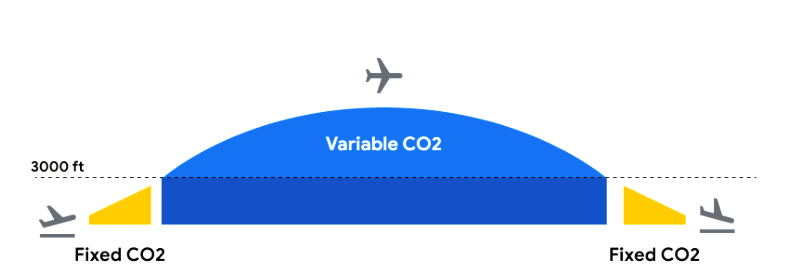

## Travel Impact Model 1.4.0

#### (Implementation of the Travalyst Shared Framework by Google)

## Table of contents
* [Background](#background)
* [Model overview](#model-overview)
    * [Flight level emission estimates](#flight-level-emission-estimates)
        * [Flight level CO2 estimates](#flight-level-co2-estimates)
        * [Data sources](#data-sources)
    * [From CO2 to CO2e emissions](#from-co2-to-co2e-emissions)
    * [Breakdown from flight level to individual level](#breakdown-from-flight-level-to-individual-level)
        * [Data sources](#data-sources-1)
        * [Factors details](#factors-details)
        * [Outlier detection and basic correctness checking](#outlier-detection-and-basic-correctness-checking)
* [Example emission estimation](#example-emission-estimation)
* [Legal base for model data sharing](#legal-base-for-model-data-sharing)
* [Versioning](#versioning)
* [Limitations](#limitations)
* [Data quality](#data-quality)
* [Contact](#contact)
* [Glossary](#glossary)
* [Appendix](#appendix)
    * [Appendix A: Aircraft type support](#appendix-a-aircraft-type-support)

## Background

In this document we describe the modeling assumptions and input specifications
behind the Travel Impact Model (TIM), a state of the art emission estimation
model that Google’s Travel Sustainability team has compiled from several
external data sources. The TIM aims at predicting carbon emissions for future
flights to help travelers plan their travel.

## Model overview

For each flight, the TIM considers several factors, such as the Great Circle
distance between the origin and destination airports and the aircraft type being
used for the route. Actual carbon emissions at flight time may vary depending on
factors not known at modeling time, such as speed and altitude of the aircraft,
the actual flight route, and weather conditions at the time of flight.

### Flight level emission estimates

#### Flight level CO2 estimates

The Travel Impact Model is based on the Tier 3 methodology for emission
estimates from the
[Annex 1.A.3.a Aviation 2019](https://www.eea.europa.eu/publications/emep-eea-guidebook-2019/part-b-sectoral-guidance-chapters/1-energy/1-a-combustion/1-a-3-a-aviation/view)
published by the European Environment Agency (EEA).

There are several resources about the EEA model available:

*   the main
    [documentation](https://www.eea.europa.eu/publications/emep-eea-guidebook-2019/part-b-sectoral-guidance-chapters/1-energy/1-a-combustion/1-a-3-a-aviation/view)
*   the
    [data set](https://www.eea.europa.eu/publications/emep-eea-guidebook-2019/part-b-sectoral-guidance-chapters/1-energy/1-a-combustion/1-a-3-a-aviation-1/view)
*   further
    [documentation](https://www.eurocontrol.int/sites/default/files/content/documents/201807-european-aviation-fuel-burn-emissions-system-eea-v2.pdf)
    on pre-work for the EEA model

The EEA model takes the efficiency of the aircraft into account. As shown in
Figure 1, a typical flight is modeled in two stages: *take off and landing*
(LTO, yellow) and *cruise, climb, and descend* (CCD, blue).

(Fig 1)

For each stage, there are aircraft-specific and distance-specific CO2
emission estimates based on the fuel burn of the aircraft. Table 1 shows an
example emissions forecast for a B789 aircraft:

<table>
  <tr>
   <td style="background-color: null"><code>Aircraft</code>
   </td>
   <td style="background-color: null"><code>Distance (nm)</code>
   </td>
   <td style="background-color: null"><code>LTO CO2 forecast (kg)</code>
   </td>
   <td style="background-color: null"><code>CCD CO2 
forecast (kg)</code>
   </td>
  </tr>
  <tr>
   <td style="background-color: null"><code>B789</code>
   </td>
   <td style="background-color: null"><code>500</code>
   </td>
   <td style="background-color: null"><code>5'439</code>
   </td>
   <td style="background-color: null"><code> 18'318</code>
   </td>
  </tr>
  <tr>
   <td style="background-color: null"><code>B789</code>
   </td>
   <td style="background-color: null"><code>1000</code>
   </td>
   <td style="background-color: null"><code>5'439</code>
   </td>
   <td style="background-color: null"><code> 33'925</code>
   </td>
  </tr>
  <tr>
   <td style="background-color: null"><code>B789</code>
   </td>
   <td style="background-color: null"><code>...</code>
   </td>
   <td style="background-color: null"><code>...</code>
   </td>
   <td style="background-color: null"><code>...</code>
   </td>
  </tr>
  <tr>
   <td style="background-color: null"><code>B789</code>
   </td>
   <td style="background-color: null"><code>5000</code>
   </td>
   <td style="background-color: null"><code>5'439</code>
   </td>
   <td style="background-color: null"><code>164'982</code>
   </td>
  </tr>
  <tr>
   <td style="background-color: null"><code>B789</code>
   </td>
   <td style="background-color: null"><code>5500</code>
   </td>
   <td style="background-color: null"><code>5'439</code>
   </td>
   <td style="background-color: null"><code>180'903</code>
   </td>
  </tr>
</table>

(Table 1)

By using these numbers together with linear interpolation or extrapolation, it
is possible to deduce the emission estimate for flights of any length on
supported aircraft:

*   Interpolation is used for flights that are in between two distance data
    points. As a theoretical example, a 5250 nautical miles flight on a Boeing
    787-9 will emit 172778.5 kg of CO2 during the CCD phase (where
    172778.5 equals 164827 + (180730 - 164827)/2 and figures for 5000nm and
    5500nm entries were taken from Table 1).
*   Extrapolation is used for flights that are either shorter than the smallest
    supported distance, or longer than the longest supported distance for that
    aircraft type.

There is information for most commonly-used aircraft types in the EEA data, but
some are missing. For missing aircraft types, one of the following alternatives
is applied in ranked order:

*   *Supported using the Piano-X data set:* If an aircraft type is supported in
    the Piano-X data set and a comparable type is supported both in the Piano-X
    and the EEA data set, a correction factor is derived by comparing the
    Piano-X output for both types across a range of missions. The correction
    factor will be applied to the LTO and CCD numbers of the comparable type in
    the EEA database.
*   *Supported by fallback to non-optimized aircraft type:* If there are
    estimates in the EEA data set for an aircraft that is identical except for
    the lack of optimizations such as winglets or sharklets, the non-optimized
    counterpart is used for the estimate.
*   *Supported by fallback to previous generation aircraft type:* If there are
    estimates in the EEA data set for a previous generation aircraft type in the
    same family, from the same manufacturer, the previous generation aircraft is
    used for the estimate.
*   *Supported by fallback to least efficient aircraft in the family:* For
    umbrella codes that refer to a group of aircraft, the least efficient
    aircraft in the family will be assumed.
*   *Not supported:* For aircraft types for which none of the cases above apply,
    there are no emissions estimates available.

See [Appendix A](#bookmark=id.pbnw7e5sw0vi) for a table with detailed
information about aircraft type support status.

#### Data sources

Used for flight level emissions:

*   EEA Report No 13/2019 1.A.3.a Aviation 1 Master emissions calculator 2019
    ([link](https://www.eea.europa.eu/publications/emep-eea-guidebook-2019/part-b-sectoral-guidance-chapters/1-energy/1-a-combustion/1-a-3-a-aviation-1/view))
*   Piano-X aircraft database ([link](https://www.lissys.uk/PianoX.html))

### From CO2 to CO2e emissions

Non-CO2 emissions from aviation are a significant fraction of
aviation’s net climate effect. As cited by the IPCC’s
[AR6 report](https://www.ipcc.ch/report/ar6/wg1/#FullReport), Lee et al.
[[2020](https://www.ncbi.nlm.nih.gov/pmc/articles/PMC7468346/)] provides a
comprehensive review of aviation climate emissions, aggregating the results from
32 published studies.

Non-CO2 emissions are predominantly Short Lived Climate Pollutants
(SLCPs), which have a shorter residency in the atmosphere and short-term
Radiative Forcing (RF) effects. Effective Radiative Forcing (ERF) — the net
warming after assessing immediate feedback effects — is used to characterize
these short-term emissions, and reported in units of mW/m2 (global
average).

The two largest warming contributors for 2018 are contrail-induced cirrus clouds
and CO2 from fuel emissions.

The TIM calculates CO2e emissions based on global warming potentials
over a 100-year horizon — GWP100, an oft-cited metric used by the Kyoto Protocol
[[UNFCCC](https://unfccc.int/process-and-meetings/transparency-and-reporting/methods-for-climate-change-transparency/common-metrics)].
GWP100 is the ratio of the rate of 100-year CO2 emissions to
non-CO2 emissions that both produce an equal integrated warming
energy over those 100 years
[[EPA](https://www.epa.gov/ghgemissions/understanding-global-warming-potentials)].

SLCP emissions can be converted to absolute CO2e by calculating the
CO2 emission (AGWP100) required to produce the same average radiative
forcing over a 100 year period. The AGWP100 of CO2 is roughly
91mW/m2 per 1Gt-CO2/yr
[[AR5, Myhre, G. et al](https://www.ipcc.ch/site/assets/uploads/2018/07/WGI_AR5.Chap_.8_SM.pdf)].
Using numbers from Lee et al (2020) presented in Table 2, the
kg-CO2e/km can then be calculated for each non-CO2 source
based on ERF, and aviation miles flown:

<table>
  <tr>
   <td colspan="4" style="background-color: null; text-align: center"><strong>2018 Aviation Emissions</strong>
   </td>
  </tr>
  <tr>
   <td style="background-color: null; text-align: center"><strong>Source </strong>
   </td>
   <td style="background-color: null; text-align: center"><strong>ERF in 2018  
</strong>(mW m−2)<strong>  
</strong>Median (5th, 95th)
   </td>
   <td style="background-color: null; text-align: center"><strong>AGWP100 
</strong> (metric megatons
CO2e yr-1) <strong> 
</strong>Median (5th, 95th)
   </td>
   <td style="background-color: null; text-align: center"><strong>CO2e per flight km* 
</strong> (kg-CO2e km-1) <strong> 
</strong>Median (5th, 95th)
   </td>
  </tr>
  <tr>
   <td style="background-color: #cccccc"><strong>Contrail cirrus</strong>
   </td>
   <td style="background-color: #cccccc">

57.4 (17, 98)

   </td>
   <td style="background-color: #cccccc">

629 (186, 1075)

   </td>
   <td style="background-color: #cccccc">

10.3 (3.0, 17.5)

   </td>
  </tr>
  <tr>
   <td style="background-color: #f3f3f3"><strong>CO2</strong>
   </td>
   <td style="background-color: #f3f3f3">

34.3 (28, 40)

   </td>
   <td style="background-color: #f3f3f3">

1034

   </td>
   <td style="background-color: #f3f3f3">

16.9

   </td>
  </tr>
</table>

(Table 2)

*Contrail cirrus is only formed for a fraction of flights. Averaged over all
flights, contrails contribute an additional estimated **61% (median)** to the
aviation emissions from CO2 alone (10.3/16.9 = 0.61).

### Breakdown from flight level to individual level

In addition to predicting a flight’s emissions, it is possible to estimate the
emissions for an individual seat on that flight. To perform this estimate, it’s
necessary to perform an individual breakdown based on three relevant factors:

1.  Number of total seats on the plane in each seating class (first, business,
    premium economy, economy)
2.  Number of occupied seats on the plane
3.  Amount of cargo being carried

The emission estimates are higher for premium economy, business and first
seating classes because the seats in these sections take up more space. As a
result, those seats account for a larger share of the flight's total emissions.
Different space allocations on narrow and wide-body aircraft are considered
using separate weighing factors.

#### Data sources

Used to determine which aircraft type was used for a given flight:

*   Aircraft type from published flight schedules

Used to determine seating configuration and calculate emissions per available
seat:

*   Aircraft Configuration/Version (ACV) from published flight schedules

#### Factors details

**Seating class factors**

Seating parameters follow
[IATA RP 1726](https://www.iata.org/en/programs/environment/passenger-emissions-methodology/).
An analysis of seat pitch and width in each seating class in typical plane
configurations confirmed the accuracy of these factors.

*   Narrow-body aircraft
    *   Economy and Premium Economy **1**
    *   Business and First **1.5**
*   Wide-body aircraft
    *   Economy **1**
    *   Premium Economy **1.5**
    *   Business **4**
    *   First **5**

**Load factors**

Load factors are derived from a projection of past passenger statistics from
2019 U.S. data average
([source](https://fred.stlouisfed.org/series/LOADFACTOR)):

*   Passenger load follows a seasonal pattern with low in Jan (~79.3%) and high
    in June (~89.8%)
    *   Aggregated overall average applied in the model is **84.5%**
*   Cargo load not included

#### Outlier detection and basic correctness checking

If there are no individual seat configuration numbers for a flight available
from the published flight schedules, or if they are incorrectly formatted or
implausible, the TIM uses aircraft-specific medians derived from the overall
dataset instead. Basic correctness checks based on reference seat configurations
for the aircraft are performed, specifically:

*   The *calculated total seat area* for a flight is the total available seating
    area. This is calculated based on seating data and seating class factors.
    For example, the total seat area for a wide-body aircraft would be:
    *   ``1.0 * num_economy_class_seats +``
         ``1.5 * num_premium_economy_class_seats +``
         ``4.0 * num_business_class_seats +``
         ``5.0 * num_first_class_seats``
*   The *reference total seat area* for an aircraft is roughly the median total
    seat area.
*   During a *comparison* step: If the *calculated total seat area* for a given
    flight is within certain boundaries of the reference for that aircraft, the
    filed seating data from published flight schedules is used. Otherwise the
    *reference total seat area* is used.

## Example emission estimation

Let’s consider the following flight parameters:

*   Origin: Zurich ZRH
*   Destination: San Francisco SFO
*   Aircraft: Boeing 787-9
    *   Economy seats: 188
    *   Premium Economy seats: 21
    *   Business seats: 48
    *   First seats: 0

To get the total emissions for a flight, let’s follow the process below:

1.  Calculate great circle distance between ZRH and SFO: 9369 km (= 5058.855
    nautical miles)
2.  Look up the static LTO numbers and the distance based CCD number from
    aircraft performance data (see Table 1), and interpolate CO2 for
    a 9369 km long flight:
    *   LTO 5.43 metric tons of CO2
    *   CCD 166.87 metric tons of CO2 calculated
        *   165.0 + (5058.9 - 5000) \* (180.9 -165.0) / (5500 - 5000)
3.  Sum LTO and CCD number multiplied with non-CO2 factor 1.61 for
    total flight level result:
    *   (166.87 \* 1.61) + 5.43 = 274.09 metric tons of CO2e

Once the total flight emissions are computed, let’s compute the per passenger
break down:

1.  Determine which seating class factors to use for the given flight. In the
    ZRH-SFO example, we will use the wide-body factors (Boeing 787-9).
2.  Calculate the equivalent capacity of the aircraft according to the following
    \
    C = first\_class\_seats \* first\_class\_multiplier + business\_class\_seats
    \* business\_class\_multiplier + …
    *   In this specific example, the estimated area is: \
        0 \* 5 + 48 \* 4 + 1.5 \* 21 + 188 \* 1 =411.5
3.  Divide the total CO2e emissions by the equivalent capacity
    calculated above to get the of CO2e emissions per-economy
    passenger: 274.09 t CO2e/411.5 = 666.08 kg CO2e
4.  Emissions per-passenger for other cabins can be derived by multiplying for
    the corresponding cabin factor.
    *   Business: 666.08 \* 4 = 2664.32 kg CO2e
    *   Premium Economy: 666.08 \* 1.5 = 999.12 kg CO2e
    *   Economy = 666.08kg CO2e
5.  Scale to estimated load factor 0.845 by apportioning emissions to occupied
    seats:
    *   Business: 2664.32 / 0.845 = 3153 kg CO2e
    *   Premium Economy: 999.12 / 0.845 = 1182 kg CO2e
    *   Economy = 666.08 / 0.845 = 788 kg CO2e

## Legal base for model data sharing

The carbon emission estimate data will be available via API under the
[Creative Commons CC BY 4.0](https://creativecommons.org/licenses/by/4.0/) open
source license
([legal code](https://creativecommons.org/licenses/by/4.0/legalcode)).

## Versioning

The model will be developed further over time, e.g. with improved load factors
methodology or more fine grained seat area ratios calculation. New versions will
be published.

A full model version will have four components: **MAJOR.MINOR.PATCH.DATE**, e.g.
1.3.1.20230101. The four tiers of change tracking are handled differently:

*   **Major versions**: Changes to the model that would break existing client
    implementations if not addressed (e.g. changes in data types or schema) or
    major methodology changes (e.g. adding new data sources to the model that
    lead to major output changes). We expect these to be infrequent but they
    need to be managed with special care.
*   **Minor versions**: Changes to the model that, while being consistent across
    schema versions, change the model parameters or implementation.
*   **Patch versions**: Implementation changes meant to address bugs or
    inaccuracies in the model implementation.
*   **Dated versions**: Model datasets are recreated with refreshed input data
    but no change to the algorithms regularly.

## Limitations

The model described in this document produces estimates of carbon emissions.
Emission estimates aim to be representative of what the typical emissions for a
flight matching the model inputs would be. Estimates might differ from actual
emissions based on a number of factors.

**Actual flight distances:** When modeling the distance between a given origin
and destination, the Great Circle Distance between the origin and destination
airport is used, as opposed to the actual distance flown.

This simplifying assumption enables the model to be used even when precise
flight path information is not available, such as when computing emission
estimates for future flights.

**Aircraft types:** The emissions model accounts for the equipment type as
published in the flight schedules. The majority of aircraft types in use are
covered. See [Appendix A](#appendix-a-aircraft-type-support) for a list of
supported aircraft types.

Some aircraft types are supported by falling back to a related model thought to
have comparable emissions. See
[Flight level emission estimates](#flight-level-emission-estimates) for more
details.

If no reasonable approximation is available for a given aircraft, the model will
not produce estimates for it.

**Cargo load factors:** Cargo load is not yet supported in the model.

**Engine information:** Beyond the aircraft type, there are other aircraft
characteristics that can have an effect on the flight emissions (e.g. engine
type, engine age, etc.) that are not currently included when computing emission
estimates.

**Fuel type:** The emissions model assumes that all flights operate on 100%
conventional fuel. Alternative fuel types (e.g. Sustainable Aviation Fuel) are
not supported.

**Greenhouse gases:** Greenhouse gases other than CO2 are not
included.

**Passenger load factors:** The same default load factor is used for every
flight instead of including seasonal, regional, and airline level factors.

This simplifying assumption was introduced during Covid-19 pandemic times.

**Seat configurations:** If there are no seat configurations individual numbers
for a flight available from published flight schedules, or if they are
incorrectly formatted or implausible, aircraft specific medians derived from the
overall dataset are employed.

## Data quality

The CO2 part of the estimates (excluding non-CO2 effects)
were validated by comparing against a limited amount of real-world fuel burn
data. The finding was that the TIM is underestimating by 7% on average.

The
[EEA guidebook](https://www.eea.europa.eu/publications/emep-eea-guidebook-2019/part-b-sectoral-guidance-chapters/1-energy/1-a-combustion/1-a-3-a-aviation/view)
(chapter 4) cites sources from ICAO that estimate the uncertainty of the LTO
factors between 5 and 10%. The CCD factor uncertainty is estimated between 15
and 40%.

## Contact

We are welcoming feedback and enquiries. Please get in touch using this
[form](https://support.google.com/travel/contact/partnersupport).

## Glossary

**CCD:** The flight phases _Climb_, _Cruise_, _and_ _Descend_ occur above a flight
altitude of 3,000 feet.

**CO2**: Carbon dioxide is the most significant long-lived greenhouse
gas in Earth's atmosphere. Since the Industrial Revolution anthropogenic
emissions – primarily from use of fossil fuels and deforestation – have rapidly
increased its concentration in the atmosphere, leading to global warming.

**Contrail-induced cirrus clouds**: Cirrus clouds are atmospheric clouds that
look like thin strands. There are natural cirrus clouds, and also contrail
induced cirrus clouds that under certain conditions occur as the result of a
contrail formation from aircraft engine exhaust.

**Radiative Forcing (RF):** Radiative Forcing is the instantaneous difference in
radiative energy flux stemming from a climate perturbation, measured at the top
of the atmosphere.

**Effective Radiative Forcing (ERF):** Radiative forcing effects can create
rapid responses in the troposphere, which can either enhance or reduce the flux
over time, and makes RF a difficult proxy for calculating long-term climate
effects. ERF attempts to capture long-term climate forcing, and represents the
change in net radiative flux after allowing for short-term responses in
atmospheric temperatures, water vapor and clouds.

**European Environment Agency (EEA):** An agency of the European Union whose
task is to provide sound, independent information on the environment.

**Google’s Travel Sustainability team**: A team at Google focusing on travel
sustainability, based in Zurich (Switzerland) and Cambridge (U.S.), with the
goal to enable users to make more sustainable travel choices.

**Great circle distance:** Defined as the shortest distance between two points
on the surface of a sphere when measured along the surface of the sphere.

**ICAO:** The International Civil Aviation Organization, a specialized agency of
the United Nations.

**LTO:** The flight phases *Take Off and Landing* occur below a flight altitude
of 3000 feet at the beginning and the end of a flight. They include the
following phases: taxi-out, taxi-in (idle), take-off, climb-out, approach and
landing.

**TIM:** The Travel Impact Model described in this document.

**Short Lived Climate Pollutants (SLCPs):** Pollutants that stay in the
atmosphere for a short time (e.g. weeks) in comparison to Long Lived Climate
Pollutants such as CO2 that stay in the atmosphere for hundreds of
years.

## Appendix

### Appendix A: Aircraft type support

<table>
  <tr>
   <td style="background-color: null"><strong>IATA aircraft code</strong>
   </td>
   <td style="background-color: null"><strong>Aircraft full name</strong>
   </td>
   <td style="background-color: null"><strong>Mapping (ICAO aircraft code)</strong>
   </td>
   <td style="background-color: null"><strong>Support status</strong>
   </td>
  </tr>
  <tr>
   <td style="background-color: null">100
   </td>
   <td style="background-color: null">Fokker 100
   </td>
   <td style="background-color: null">F100
   </td>
   <td style="background-color: null">Direct match in EEA
   </td>
  </tr>
  <tr>
   <td style="background-color: null">146
   </td>
   <td style="background-color: null">British Aerospace 146
   </td>
   <td style="background-color: null">BAE146
   </td>
   <td style="background-color: null">Direct match in EEA
   </td>
  </tr>
  <tr>
   <td style="background-color: null">221
   </td>
   <td style="background-color: null">Airbus A220-100
   </td>
   <td style="background-color: null">
   </td>
   <td style="background-color: null">Supported via correction factor derived from Piano data
   </td>
  </tr>
  <tr>
   <td style="background-color: null">223
   </td>
   <td style="background-color: null">Airbus A220-300
   </td>
   <td style="background-color: null">
   </td>
   <td style="background-color: null">Supported via correction factor derived from Piano data
   </td>
  </tr>
  <tr>
   <td style="background-color: null">290
   </td>
   <td style="background-color: null">Embraer 190 E2
   </td>
   <td style="background-color: null">E190
   </td>
   <td style="background-color: null">Mapped onto older model
   </td>
  </tr>
  <tr>
   <td style="background-color: null">295
   </td>
   <td style="background-color: null">Embraer 195 E2
   </td>
   <td style="background-color: null">E195
   </td>
   <td style="background-color: null">Mapped onto older model
   </td>
  </tr>
  <tr>
   <td style="background-color: null">310
   </td>
   <td style="background-color: null">Airbus A310
   </td>
   <td style="background-color: null">A310
   </td>
   <td style="background-color: null">Direct match in EEA
   </td>
  </tr>
  <tr>
   <td style="background-color: null">313
   </td>
   <td style="background-color: null">Airbus A310-300
   </td>
   <td style="background-color: null">A310
   </td>
   <td style="background-color: null">Direct match in EEA
   </td>
  </tr>
  <tr>
   <td style="background-color: null">318
   </td>
   <td style="background-color: null">Airbus A318
   </td>
   <td style="background-color: null">A318
   </td>
   <td style="background-color: null">Direct match in EEA
   </td>
  </tr>
  <tr>
   <td style="background-color: null">319
   </td>
   <td style="background-color: null">Airbus A319
   </td>
   <td style="background-color: null">A319
   </td>
   <td style="background-color: null">Direct match in EEA
   </td>
  </tr>
  <tr>
   <td style="background-color: null">320
   </td>
   <td style="background-color: null">Airbus A320-100/200
   </td>
   <td style="background-color: null">A320
   </td>
   <td style="background-color: null">Direct match in EEA
   </td>
  </tr>
  <tr>
   <td style="background-color: null">321
   </td>
   <td style="background-color: null">Airbus A321
   </td>
   <td style="background-color: null">A321
   </td>
   <td style="background-color: null">Direct match in EEA
   </td>
  </tr>
  <tr>
   <td style="background-color: null">330
   </td>
   <td style="background-color: null">Airbus A330
   </td>
   <td style="background-color: null">A332
   </td>
   <td style="background-color: null">Mapped to least efficient in family
   </td>
  </tr>
  <tr>
   <td style="background-color: null">332
   </td>
   <td style="background-color: null">Airbus A330-200
   </td>
   <td style="background-color: null">A332
   </td>
   <td style="background-color: null">Direct match in EEA
   </td>
  </tr>
  <tr>
   <td style="background-color: null">333
   </td>
   <td style="background-color: null">Airbus A330-300
   </td>
   <td style="background-color: null">A333
   </td>
   <td style="background-color: null">Direct match in EEA
   </td>
  </tr>
  <tr>
   <td style="background-color: null">339
   </td>
   <td style="background-color: null">Airbus A330-900neo
   </td>
   <td style="background-color: null">A333
   </td>
   <td style="background-color: null">Supported via correction factor derived from Piano data
   </td>
  </tr>
  <tr>
   <td style="background-color: null">340
   </td>
   <td style="background-color: null">Airbus A340
   </td>
   <td style="background-color: null">A345
   </td>
   <td style="background-color: null">Mapped to least efficient in family
   </td>
  </tr>
  <tr>
   <td style="background-color: null">343
   </td>
   <td style="background-color: null">Airbus A340-300
   </td>
   <td style="background-color: null">A343
   </td>
   <td style="background-color: null">Direct match in EEA
   </td>
  </tr>
  <tr>
   <td style="background-color: null">345
   </td>
   <td style="background-color: null">Airbus A340-500
   </td>
   <td style="background-color: null">A345
   </td>
   <td style="background-color: null">Direct match in EEA
   </td>
  </tr>
  <tr>
   <td style="background-color: null">346
   </td>
   <td style="background-color: null">Airbus A340-600
   </td>
   <td style="background-color: null">A346
   </td>
   <td style="background-color: null">Direct match in EEA
   </td>
  </tr>
  <tr>
   <td style="background-color: null">350
   </td>
   <td style="background-color: null">Airbus A350
   </td>
   <td style="background-color: null">A350
   </td>
   <td style="background-color: null">Mapped to least efficient in family
   </td>
  </tr>
  <tr>
   <td style="background-color: null">351
   </td>
   <td style="background-color: null">Airbus Industrie A350-1000
   </td>
   <td style="background-color: null">A350
   </td>
   <td style="background-color: null">Supported via correction factor derived from Piano data
   </td>
  </tr>
  <tr>
   <td style="background-color: null">359
   </td>
   <td style="background-color: null">Airbus A350-900
   </td>
   <td style="background-color: null">A350
   </td>
   <td style="background-color: null">Direct match in EEA
   </td>
  </tr>
  <tr>
   <td style="background-color: null">380
   </td>
   <td style="background-color: null">Airbus A380
   </td>
   <td style="background-color: null">A380
   </td>
   <td style="background-color: null">Mapped to least efficient in family
   </td>
  </tr>
  <tr>
   <td style="background-color: null">388
   </td>
   <td style="background-color: null">Airbus A380-800
   </td>
   <td style="background-color: null">A380
   </td>
   <td style="background-color: null">Direct match in EEA
   </td>
  </tr>
  <tr>
   <td style="background-color: null">717
   </td>
   <td style="background-color: null">Boeing 717-200
   </td>
   <td style="background-color: null">B717
   </td>
   <td style="background-color: null">Direct match in EEA
   </td>
  </tr>
  <tr>
   <td style="background-color: null">732
   </td>
   <td style="background-color: null">Boeing 737-200
   </td>
   <td style="background-color: null">B732
   </td>
   <td style="background-color: null">Direct match in EEA
   </td>
  </tr>
  <tr>
   <td style="background-color: null">733
   </td>
   <td style="background-color: null">Boeing 737-300
   </td>
   <td style="background-color: null">B733
   </td>
   <td style="background-color: null">Direct match in EEA
   </td>
  </tr>
  <tr>
   <td style="background-color: null">734
   </td>
   <td style="background-color: null">Boeing 737-400
   </td>
   <td style="background-color: null">B734
   </td>
   <td style="background-color: null">Direct match in EEA
   </td>
  </tr>
  <tr>
   <td style="background-color: null">735
   </td>
   <td style="background-color: null">Boeing 737-500
   </td>
   <td style="background-color: null">B735
   </td>
   <td style="background-color: null">Direct match in EEA
   </td>
  </tr>
  <tr>
   <td style="background-color: null">736
   </td>
   <td style="background-color: null">Boeing 737-600
   </td>
   <td style="background-color: null">B736
   </td>
   <td style="background-color: null">Direct match in EEA
   </td>
  </tr>
  <tr>
   <td style="background-color: null">737
   </td>
   <td style="background-color: null">Boeing 737
   </td>
   <td style="background-color: null">B734
   </td>
   <td style="background-color: null">Mapped to least efficient in family
   </td>
  </tr>
  <tr>
   <td style="background-color: null">738
   </td>
   <td style="background-color: null">Boeing 737-800
   </td>
   <td style="background-color: null">B738
   </td>
   <td style="background-color: null">Direct match in EEA
   </td>
  </tr>
  <tr>
   <td style="background-color: null">739
   </td>
   <td style="background-color: null">Boeing 737-900
   </td>
   <td style="background-color: null">B739
   </td>
   <td style="background-color: null">Direct match in EEA
   </td>
  </tr>
  <tr>
   <td style="background-color: null">744
   </td>
   <td style="background-color: null">Boeing 747-400
   </td>
   <td style="background-color: null">B744
   </td>
   <td style="background-color: null">Direct match in EEA
   </td>
  </tr>
  <tr>
   <td style="background-color: null">747
   </td>
   <td style="background-color: null">Boeing 747
   </td>
   <td style="background-color: null">B744
   </td>
   <td style="background-color: null">Mapped to least efficient in family
   </td>
  </tr>
  <tr>
   <td style="background-color: null">752
   </td>
   <td style="background-color: null">Boeing 757-200
   </td>
   <td style="background-color: null">B752
   </td>
   <td style="background-color: null">Direct match in EEA
   </td>
  </tr>
  <tr>
   <td style="background-color: null">753
   </td>
   <td style="background-color: null">Boeing 757-300
   </td>
   <td style="background-color: null">B753
   </td>
   <td style="background-color: null">Direct match in EEA
   </td>
  </tr>
  <tr>
   <td style="background-color: null">757
   </td>
   <td style="background-color: null">Boeing 757
   </td>
   <td style="background-color: null">B753
   </td>
   <td style="background-color: null">Mapped to least efficient in family
   </td>
  </tr>
  <tr>
   <td style="background-color: null">762
   </td>
   <td style="background-color: null">Boeing 767-200
   </td>
   <td style="background-color: null">B762
   </td>
   <td style="background-color: null">Direct match in EEA
   </td>
  </tr>
  <tr>
   <td style="background-color: null">763
   </td>
   <td style="background-color: null">Boeing 767-300
   </td>
   <td style="background-color: null">B763
   </td>
   <td style="background-color: null">Direct match in EEA
   </td>
  </tr>
  <tr>
   <td style="background-color: null">764
   </td>
   <td style="background-color: null">Boeing 767-400
   </td>
   <td style="background-color: null">B764
   </td>
   <td style="background-color: null">Direct match in EEA
   </td>
  </tr>
  <tr>
   <td style="background-color: null">767
   </td>
   <td style="background-color: null">Boeing 767
   </td>
   <td style="background-color: null">B764
   </td>
   <td style="background-color: null">Mapped to least efficient in family
   </td>
  </tr>
  <tr>
   <td style="background-color: null">772
   </td>
   <td style="background-color: null">Boeing 777-200/200ER
   </td>
   <td style="background-color: null">B772
   </td>
   <td style="background-color: null">Direct match in EEA
   </td>
  </tr>
  <tr>
   <td style="background-color: null">773
   </td>
   <td style="background-color: null">Boeing 777-300
   </td>
   <td style="background-color: null">B773
   </td>
   <td style="background-color: null">Direct match in EEA
   </td>
  </tr>
  <tr>
   <td style="background-color: null">777
   </td>
   <td style="background-color: null">Boeing 777
   </td>
   <td style="background-color: null">B773
   </td>
   <td style="background-color: null">Mapped to least efficient in family
   </td>
  </tr>
  <tr>
   <td style="background-color: null">781
   </td>
   <td style="background-color: null">Boeing 787-10
   </td>
   <td style="background-color: null">
   </td>
   <td style="background-color: null">Supported via correction factor derived from Piano data
   </td>
  </tr>
  <tr>
   <td style="background-color: null">787
   </td>
   <td style="background-color: null">Boeing 787
   </td>
   <td style="background-color: null">B789
   </td>
   <td style="background-color: null">Mapped to least efficient in family
   </td>
  </tr>
  <tr>
   <td style="background-color: null">788
   </td>
   <td style="background-color: null">Boeing 787-8
   </td>
   <td style="background-color: null">B788
   </td>
   <td style="background-color: null">Direct match in EEA
   </td>
  </tr>
  <tr>
   <td style="background-color: null">789
   </td>
   <td style="background-color: null">Boeing 787-9
   </td>
   <td style="background-color: null">B789
   </td>
   <td style="background-color: null">Direct match in EEA
   </td>
  </tr>
  <tr>
   <td style="background-color: null">32A
   </td>
   <td style="background-color: null">Airbus Industrie A320 (Sharklets)
   </td>
   <td style="background-color: null">
   </td>
   <td style="background-color: null">Supported via correction factor derived from Piano data
   </td>
  </tr>
  <tr>
   <td style="background-color: null">32B
   </td>
   <td style="background-color: null">Airbus Industrie A321 (Sharklets)
   </td>
   <td style="background-color: null">
   </td>
   <td style="background-color: null">Supported via correction factor derived from Piano data
   </td>
  </tr>
  <tr>
   <td style="background-color: null">32N
   </td>
   <td style="background-color: null">Airbus A320neo
   </td>
   <td style="background-color: null">
   </td>
   <td style="background-color: null">Supported via correction factor derived from Piano data
   </td>
  </tr>
  <tr>
   <td style="background-color: null">32Q
   </td>
   <td style="background-color: null">Airbus A321neo
   </td>
   <td style="background-color: null">
   </td>
   <td style="background-color: null">Supported via correction factor derived from Piano data
   </td>
  </tr>
  <tr>
   <td style="background-color: null">32S
   </td>
   <td style="background-color: null">Airbus A318/A319/A320/A321
   </td>
   <td style="background-color: null">A321
   </td>
   <td style="background-color: null">Mapped to least efficient in family
   </td>
  </tr>
  <tr>
   <td style="background-color: null">73C
   </td>
   <td style="background-color: null">Boeing 737-300 (winglets)
   </td>
   <td style="background-color: null">B733
   </td>
   <td style="background-color: null">Mapped to non-optimized aircraft
   </td>
  </tr>
  <tr>
   <td style="background-color: null">73E
   </td>
   <td style="background-color: null">Boeing 737-500 (winglets)
   </td>
   <td style="background-color: null">B735
   </td>
   <td style="background-color: null">Mapped to non-optimized aircraft
   </td>
  </tr>
  <tr>
   <td style="background-color: null">73F
   </td>
   <td style="background-color: null">Boeing 737 Freighter
   </td>
   <td style="background-color: null">B734
   </td>
   <td style="background-color: null">Mapped to least efficient in family
   </td>
  </tr>
  <tr>
   <td style="background-color: null">73G
   </td>
   <td style="background-color: null">Boeing 737-700
   </td>
   <td style="background-color: null">B737
   </td>
   <td style="background-color: null">Direct match in EEA
   </td>
  </tr>
  <tr>
   <td style="background-color: null">73H
   </td>
   <td style="background-color: null">Boeing 737-800 (winglets)
   </td>
   <td style="background-color: null">
   </td>
   <td style="background-color: null">Supported via correction factor derived from Piano data
   </td>
  </tr>
  <tr>
   <td style="background-color: null">73J
   </td>
   <td style="background-color: null">Boeing 737-900 (winglets)
   </td>
   <td style="background-color: null">B739
   </td>
   <td style="background-color: null">Mapped to non-optimized aircraft
   </td>
  </tr>
  <tr>
   <td style="background-color: null">73M
   </td>
   <td style="background-color: null">Boeing 737-200
   </td>
   <td style="background-color: null">B732
   </td>
   <td style="background-color: null">Direct match in EEA
   </td>
  </tr>
  <tr>
   <td style="background-color: null">73N
   </td>
   <td style="background-color: null">Boeing 737-300
   </td>
   <td style="background-color: null">B733
   </td>
   <td style="background-color: null">Direct match in EEA
   </td>
  </tr>
  <tr>
   <td style="background-color: null">73Q
   </td>
   <td style="background-color: null">Boeing 737-400
   </td>
   <td style="background-color: null">B734
   </td>
   <td style="background-color: null">Direct match in EEA
   </td>
  </tr>
  <tr>
   <td style="background-color: null">73S
   </td>
   <td style="background-color: null">Boeing 737-200/200 Advanced
   </td>
   <td style="background-color: null">B732
   </td>
   <td style="background-color: null">Direct match in EEA
   </td>
  </tr>
  <tr>
   <td style="background-color: null">73W
   </td>
   <td style="background-color: null">Boeing 737-700 (winglets)
   </td>
   <td style="background-color: null">
   </td>
   <td style="background-color: null">Supported via correction factor derived from Piano data
   </td>
  </tr>
  <tr>
   <td style="background-color: null">74E
   </td>
   <td style="background-color: null">Boeing 747-400 Mixed
   </td>
   <td style="background-color: null">B744
   </td>
   <td style="background-color: null">Direct match in EEA
   </td>
  </tr>
  <tr>
   <td style="background-color: null">74F
   </td>
   <td style="background-color: null">Boeing 747 Freighter
   </td>
   <td style="background-color: null">B744
   </td>
   <td style="background-color: null">Mapped to least efficient in family
   </td>
  </tr>
  <tr>
   <td style="background-color: null">74H
   </td>
   <td style="background-color: null">Boeing 747-8I
   </td>
   <td style="background-color: null">B744
   </td>
   <td style="background-color: null">Mapped onto older model
   </td>
  </tr>
  <tr>
   <td style="background-color: null">74N
   </td>
   <td style="background-color: null">Boeing 747-8F (Freighter)
   </td>
   <td style="background-color: null">B744
   </td>
   <td style="background-color: null">Mapped onto older model
   </td>
  </tr>
  <tr>
   <td style="background-color: null">74Y
   </td>
   <td style="background-color: null">Boeing 747-400F Freighter
   </td>
   <td style="background-color: null">B744
   </td>
   <td style="background-color: null">Direct match in EEA
   </td>
  </tr>
  <tr>
   <td style="background-color: null">75T
   </td>
   <td style="background-color: null">Boeing 757-300 (winglets)
   </td>
   <td style="background-color: null">B753
   </td>
   <td style="background-color: null">Mapped to non-optimized aircraft
   </td>
  </tr>
  <tr>
   <td style="background-color: null">75W
   </td>
   <td style="background-color: null">Boeing 757-200 (winglets)
   </td>
   <td style="background-color: null">
   </td>
   <td style="background-color: null">Supported via correction factor derived from Piano data
   </td>
  </tr>
  <tr>
   <td style="background-color: null">76W
   </td>
   <td style="background-color: null">Boeing 767-300 (winglets)
   </td>
   <td style="background-color: null">
   </td>
   <td style="background-color: null">Supported via correction factor derived from Piano data
   </td>
  </tr>
  <tr>
   <td style="background-color: null">77F
   </td>
   <td style="background-color: null">Boeing 777 Freighter
   </td>
   <td style="background-color: null">B773
   </td>
   <td style="background-color: null">Mapped to least efficient in family
   </td>
  </tr>
  <tr>
   <td style="background-color: null">77L
   </td>
   <td style="background-color: null">Boeing 777-200LR
   </td>
   <td style="background-color: null">B772
   </td>
   <td style="background-color: null">Mapped to similar model
   </td>
  </tr>
  <tr>
   <td style="background-color: null">77W
   </td>
   <td style="background-color: null">Boeing 777-300ER
   </td>
   <td style="background-color: null">B77W
   </td>
   <td style="background-color: null">Direct match in EEA
   </td>
  </tr>
  <tr>
   <td style="background-color: null">77X
   </td>
   <td style="background-color: null">Boeing 777-200F Freighter
   </td>
   <td style="background-color: null">B772
   </td>
   <td style="background-color: null">Direct match in EEA
   </td>
  </tr>
  <tr>
   <td style="background-color: null">7M8
   </td>
   <td style="background-color: null">Boeing 737MAX 8
   </td>
   <td style="background-color: null">
   </td>
   <td style="background-color: null">Supported via correction factor derived from Piano data
   </td>
  </tr>
  <tr>
   <td style="background-color: null">7M9
   </td>
   <td style="background-color: null">Boeing 737MAX 9
   </td>
   <td style="background-color: null">
   </td>
   <td style="background-color: null">Supported via correction factor derived from Piano data
   </td>
  </tr>
  <tr>
   <td style="background-color: null">7S8
   </td>
   <td style="background-color: null">Boeing 737-800 (Scimitar Winglets)
   </td>
   <td style="background-color: null">
   </td>
   <td style="background-color: null">Supported via correction factor derived from Piano data
   </td>
  </tr>
  <tr>
   <td style="background-color: null">A32
   </td>
   <td style="background-color: null">Antonov AN-32
   </td>
   <td style="background-color: null">AN32
   </td>
   <td style="background-color: null">Direct match in EEA
   </td>
  </tr>
  <tr>
   <td style="background-color: null">A81
   </td>
   <td style="background-color: null">Antonov AN-148-100
   </td>
   <td style="background-color: null">AN148
   </td>
   <td style="background-color: null">Direct match in EEA
   </td>
  </tr>
  <tr>
   <td style="background-color: null">AB4
   </td>
   <td style="background-color: null">Airbus A300B2/B4/C4
   </td>
   <td style="background-color: null">A30B
   </td>
   <td style="background-color: null">Direct match in EEA
   </td>
  </tr>
  <tr>
   <td style="background-color: null">AB6
   </td>
   <td style="background-color: null">Airbus A300-600/600C
   </td>
   <td style="background-color: null">A306
   </td>
   <td style="background-color: null">Direct match in EEA
   </td>
  </tr>
  <tr>
   <td style="background-color: null">ABY
   </td>
   <td style="background-color: null">Airbus A300-600 Freighter
   </td>
   <td style="background-color: null">A306
   </td>
   <td style="background-color: null">Direct match in EEA
   </td>
  </tr>
  <tr>
   <td style="background-color: null">AN4
   </td>
   <td style="background-color: null">Antonov AN-24
   </td>
   <td style="background-color: null">AN24
   </td>
   <td style="background-color: null">Direct match in EEA
   </td>
  </tr>
  <tr>
   <td style="background-color: null">AN6
   </td>
   <td style="background-color: null">Antonov AN-26/30/32
   </td>
   <td style="background-color: null">AN32
   </td>
   <td style="background-color: null">Mapped to least efficient in family
   </td>
  </tr>
  <tr>
   <td style="background-color: null">AR1
   </td>
   <td style="background-color: null">Avro Regional Jet RJ100 Avroliner
   </td>
   <td style="background-color: null">
   </td>
   <td style="background-color: null">Not supported
   </td>
  </tr>
  <tr>
   <td style="background-color: null">AR8
   </td>
   <td style="background-color: null">Avro Regional Jet RJ85 Avroliner
   </td>
   <td style="background-color: null">
   </td>
   <td style="background-color: null">Not supported
   </td>
  </tr>
  <tr>
   <td style="background-color: null">ARJ
   </td>
   <td style="background-color: null">Avro Regional Jet Avroliner
   </td>
   <td style="background-color: null">
   </td>
   <td style="background-color: null">Not supported
   </td>
  </tr>
  <tr>
   <td style="background-color: null">AT4
   </td>
   <td style="background-color: null">ATR 42-300/320
   </td>
   <td style="background-color: null">ATR42
   </td>
   <td style="background-color: null">Mapped to similar model
   </td>
  </tr>
  <tr>
   <td style="background-color: null">AT5
   </td>
   <td style="background-color: null">ATR 42-500
   </td>
   <td style="background-color: null">ATR42
   </td>
   <td style="background-color: null">Direct match in EEA
   </td>
  </tr>
  <tr>
   <td style="background-color: null">AT7
   </td>
   <td style="background-color: null">ATR 72
   </td>
   <td style="background-color: null">ATR72
   </td>
   <td style="background-color: null">Direct match in EEA
   </td>
  </tr>
  <tr>
   <td style="background-color: null">ATR
   </td>
   <td style="background-color: null">ATR 42/ATR 72
   </td>
   <td style="background-color: null">ATR72
   </td>
   <td style="background-color: null">Mapped to least efficient in family
   </td>
  </tr>
  <tr>
   <td style="background-color: null">BE1
   </td>
   <td style="background-color: null">Beechcraft 1900
   </td>
   <td style="background-color: null">
   </td>
   <td style="background-color: null">Not supported
   </td>
  </tr>
  <tr>
   <td style="background-color: null">BE9
   </td>
   <td style="background-color: null">Beechcraft C99 Airliner
   </td>
   <td style="background-color: null">
   </td>
   <td style="background-color: null">Not supported
   </td>
  </tr>
  <tr>
   <td style="background-color: null">BEH
   </td>
   <td style="background-color: null">Beechcraft 1900D
   </td>
   <td style="background-color: null">
   </td>
   <td style="background-color: null">Not supported
   </td>
  </tr>
  <tr>
   <td style="background-color: null">BES
   </td>
   <td style="background-color: null">Beechcraft 1900/1900C
   </td>
   <td style="background-color: null">
   </td>
   <td style="background-color: null">Not supported
   </td>
  </tr>
  <tr>
   <td style="background-color: null">BET
   </td>
   <td style="background-color: null">Beechcraft Light Aircraft twin engine
   </td>
   <td style="background-color: null">
   </td>
   <td style="background-color: null">Not supported
   </td>
  </tr>
  <tr>
   <td style="background-color: null">BNI
   </td>
   <td style="background-color: null">Pilatus Brit-Norm BN-2A/B ISL/BN-2T
   </td>
   <td style="background-color: null">
   </td>
   <td style="background-color: null">Not supported
   </td>
  </tr>
  <tr>
   <td style="background-color: null">C27
   </td>
   <td style="background-color: null">Comac ARJ21-700
   </td>
   <td style="background-color: null">
   </td>
   <td style="background-color: null">Not supported
   </td>
  </tr>
  <tr>
   <td style="background-color: null">CNA
   </td>
   <td style="background-color: null">Cessna (Light Aircraft)
   </td>
   <td style="background-color: null">C208
   </td>
   <td style="background-color: null">Direct match in EEA
   </td>
  </tr>
  <tr>
   <td style="background-color: null">CNC
   </td>
   <td style="background-color: null">Cessna (Light Aircraft - single engine)
   </td>
   <td style="background-color: null">C208
   </td>
   <td style="background-color: null">Direct match in EEA
   </td>
  </tr>
  <tr>
   <td style="background-color: null">CNF
   </td>
   <td style="background-color: null">Cessna 208B Freighter
   </td>
   <td style="background-color: null">C208
   </td>
   <td style="background-color: null">Direct match in EEA
   </td>
  </tr>
  <tr>
   <td style="background-color: null">CNJ
   </td>
   <td style="background-color: null">Cessna Citation
   </td>
   <td style="background-color: null">C500
   </td>
   <td style="background-color: null">Direct match in EEA
   </td>
  </tr>
  <tr>
   <td style="background-color: null">CR1
   </td>
   <td style="background-color: null">Canadair Regional Jet 100
   </td>
   <td style="background-color: null">
   </td>
   <td style="background-color: null">Not supported
   </td>
  </tr>
  <tr>
   <td style="background-color: null">CR2
   </td>
   <td style="background-color: null">Canadair Regional Jet 200
   </td>
   <td style="background-color: null">
   </td>
   <td style="background-color: null">Not supported
   </td>
  </tr>
  <tr>
   <td style="background-color: null">CR5
   </td>
   <td style="background-color: null">Canadair Regional Jet 550
   </td>
   <td style="background-color: null">
   </td>
   <td style="background-color: null">Supported via correction factor derived from Piano data
   </td>
  </tr>
  <tr>
   <td style="background-color: null">CR7
   </td>
   <td style="background-color: null">Canadair Regional Jet 700
   </td>
   <td style="background-color: null">CS700RJ
   </td>
   <td style="background-color: null">Direct match in EEA
   </td>
  </tr>
  <tr>
   <td style="background-color: null">CR9
   </td>
   <td style="background-color: null">Canadair Regional Jet 900
   </td>
   <td style="background-color: null">CS900RJ
   </td>
   <td style="background-color: null">Direct match in EEA
   </td>
  </tr>
  <tr>
   <td style="background-color: null">CRJ
   </td>
   <td style="background-color: null">Canadair Regional Jet
   </td>
   <td style="background-color: null">CS900RJ
   </td>
   <td style="background-color: null">Mapped to least efficient in family
   </td>
  </tr>
  <tr>
   <td style="background-color: null">CRK
   </td>
   <td style="background-color: null">Canadair Regional Jet 1000
   </td>
   <td style="background-color: null">
   </td>
   <td style="background-color: null">Not supported
   </td>
  </tr>
  <tr>
   <td style="background-color: null">CS1
   </td>
   <td style="background-color: null">Bombardier CS100
   </td>
   <td style="background-color: null">
   </td>
   <td style="background-color: null">Not supported
   </td>
  </tr>
  <tr>
   <td style="background-color: null">CS3
   </td>
   <td style="background-color: null">Bombardier CS300
   </td>
   <td style="background-color: null">
   </td>
   <td style="background-color: null">Not supported
   </td>
  </tr>
  <tr>
   <td style="background-color: null">CVF
   </td>
   <td style="background-color: null">Convair 440/580/600/640 Freighter
   </td>
   <td style="background-color: null">
   </td>
   <td style="background-color: null">Not supported
   </td>
  </tr>
  <tr>
   <td style="background-color: null">DH2
   </td>
   <td style="background-color: null">De Havilland-Bombardier DHC-8 Dash 8 Series 200
   </td>
   <td style="background-color: null">DHC8
   </td>
   <td style="background-color: null">Mapped to non-optimized aircraft
   </td>
  </tr>
  <tr>
   <td style="background-color: null">DH3
   </td>
   <td style="background-color: null">De Havilland-Bombardier DHC-8 Dash 8 Series 300
   </td>
   <td style="background-color: null">DHC8
   </td>
   <td style="background-color: null">Mapped to non-optimized aircraft
   </td>
  </tr>
  <tr>
   <td style="background-color: null">DH4
   </td>
   <td style="background-color: null">De Havilland-Bombardier DHC-8 Dash 8 Series 400
   </td>
   <td style="background-color: null">DHC8
   </td>
   <td style="background-color: null">Mapped to non-optimized aircraft
   </td>
  </tr>
  <tr>
   <td style="background-color: null">DH8
   </td>
   <td style="background-color: null">De Havilland-Bombardier DHC-8 Dash 8
   </td>
   <td style="background-color: null">DHC8
   </td>
   <td style="background-color: null">Direct match in EEA
   </td>
  </tr>
  <tr>
   <td style="background-color: null">DHC
   </td>
   <td style="background-color: null">De Havilland-Bombardier DHC-4 Caribou
   </td>
   <td style="background-color: null">
   </td>
   <td style="background-color: null">Not supported
   </td>
  </tr>
  <tr>
   <td style="background-color: null">DHT
   </td>
   <td style="background-color: null">De Havilland-Bombardier DHC-6 Twin Otter
   </td>
   <td style="background-color: null">DHC6
   </td>
   <td style="background-color: null">Direct match in EEA
   </td>
  </tr>
  <tr>
   <td style="background-color: null">E70
   </td>
   <td style="background-color: null">Embraer 170 Regional Jet
   </td>
   <td style="background-color: null">E170
   </td>
   <td style="background-color: null">Direct match in EEA
   </td>
  </tr>
  <tr>
   <td style="background-color: null">E75
   </td>
   <td style="background-color: null">Embraer 175 Regional Jet
   </td>
   <td style="background-color: null">E175
   </td>
   <td style="background-color: null">Direct match in EEA
   </td>
  </tr>
  <tr>
   <td style="background-color: null">E7W
   </td>
   <td style="background-color: null">Embraer 175 (Enhanced Winglets)
   </td>
   <td style="background-color: null">
   </td>
   <td style="background-color: null">Supported via correction factor derived from Piano data
   </td>
  </tr>
  <tr>
   <td style="background-color: null">E90
   </td>
   <td style="background-color: null">Embraer 190 Regional Jet
   </td>
   <td style="background-color: null">E190
   </td>
   <td style="background-color: null">Direct match in EEA
   </td>
  </tr>
  <tr>
   <td style="background-color: null">E95
   </td>
   <td style="background-color: null">Embraer 195 Regional Jet
   </td>
   <td style="background-color: null">E195
   </td>
   <td style="background-color: null">Direct match in EEA
   </td>
  </tr>
  <tr>
   <td style="background-color: null">EM2
   </td>
   <td style="background-color: null">Embraer EMB-120 Brasilia
   </td>
   <td style="background-color: null">E120
   </td>
   <td style="background-color: null">Direct match in EEA
   </td>
  </tr>
  <tr>
   <td style="background-color: null">EMB
   </td>
   <td style="background-color: null">Embraer EMB-110 Bandeirante
   </td>
   <td style="background-color: null">E110
   </td>
   <td style="background-color: null">Direct match in EEA
   </td>
  </tr>
  <tr>
   <td style="background-color: null">EMJ
   </td>
   <td style="background-color: null">Embraer RJ-170/175/190/195 Regional Jet
   </td>
   <td style="background-color: null">
   </td>
   <td style="background-color: null">Mapped to least efficient in family
   </td>
  </tr>
  <tr>
   <td style="background-color: null">ER3
   </td>
   <td style="background-color: null">Embraer ERJ-135 Regional Jet
   </td>
   <td style="background-color: null">E135
   </td>
   <td style="background-color: null">Direct match in EEA
   </td>
  </tr>
  <tr>
   <td style="background-color: null">ER4
   </td>
   <td style="background-color: null">Embraer ERJ-145 Regional Jet
   </td>
   <td style="background-color: null">E145
   </td>
   <td style="background-color: null">Direct match in EEA
   </td>
  </tr>
  <tr>
   <td style="background-color: null">ERD
   </td>
   <td style="background-color: null">Embraer ERJ-140 Regional Jet
   </td>
   <td style="background-color: null">E145
   </td>
   <td style="background-color: null">Direct match in EEA
   </td>
  </tr>
  <tr>
   <td style="background-color: null">ERJ
   </td>
   <td style="background-color: null">Embraer ERJ-135/140/145 Regional Jet
   </td>
   <td style="background-color: null">
   </td>
   <td style="background-color: null">Mapped to least efficient in family
   </td>
  </tr>
  <tr>
   <td style="background-color: null">F50
   </td>
   <td style="background-color: null">Fokker 50
   </td>
   <td style="background-color: null">F50
   </td>
   <td style="background-color: null">Direct match in EEA
   </td>
  </tr>
  <tr>
   <td style="background-color: null">F70
   </td>
   <td style="background-color: null">Fokker 70
   </td>
   <td style="background-color: null">F70
   </td>
   <td style="background-color: null">Direct match in EEA
   </td>
  </tr>
  <tr>
   <td style="background-color: null">FRJ
   </td>
   <td style="background-color: null">Fairchild Dornier 328JET
   </td>
   <td style="background-color: null">
   </td>
   <td style="background-color: null">Not supported
   </td>
  </tr>
  <tr>
   <td style="background-color: null">IL7
   </td>
   <td style="background-color: null">Ilyushin IL-76
   </td>
   <td style="background-color: null">IL76
   </td>
   <td style="background-color: null">Direct match in EEA
   </td>
  </tr>
  <tr>
   <td style="background-color: null">IL9
   </td>
   <td style="background-color: null">Ilyushin IL-96-300
   </td>
   <td style="background-color: null">IL96
   </td>
   <td style="background-color: null">Direct match in EEA
   </td>
  </tr>
  <tr>
   <td style="background-color: null">J32
   </td>
   <td style="background-color: null">British Aerospace Jetstream 32
   </td>
   <td style="background-color: null">
   </td>
   <td style="background-color: null">Not supported
   </td>
  </tr>
  <tr>
   <td style="background-color: null">J41
   </td>
   <td style="background-color: null">British Aerospace Jetstream 41
   </td>
   <td style="background-color: null">
   </td>
   <td style="background-color: null">Not supported
   </td>
  </tr>
  <tr>
   <td style="background-color: null">JST
   </td>
   <td style="background-color: null">British Aerospace Jetstream 31/32/41
   </td>
   <td style="background-color: null">
   </td>
   <td style="background-color: null">Not supported
   </td>
  </tr>
  <tr>
   <td style="background-color: null">L4T
   </td>
   <td style="background-color: null">LET L410 Turbolet
   </td>
   <td style="background-color: null">L410
   </td>
   <td style="background-color: null">Direct match in EEA
   </td>
  </tr>
  <tr>
   <td style="background-color: null">M1F
   </td>
   <td style="background-color: null">McDonnell Douglas MD-11 Freighter
   </td>
   <td style="background-color: null">MD11
   </td>
   <td style="background-color: null">Direct match in EEA
   </td>
  </tr>
  <tr>
   <td style="background-color: null">M80
   </td>
   <td style="background-color: null">McDonnell Douglas MD-80
   </td>
   <td style="background-color: null">
   </td>
   <td style="background-color: null">Not supported
   </td>
  </tr>
  <tr>
   <td style="background-color: null">M83
   </td>
   <td style="background-color: null">McDonnell Douglas MD-83
   </td>
   <td style="background-color: null">
   </td>
   <td style="background-color: null">Not supported
   </td>
  </tr>
  <tr>
   <td style="background-color: null">M87
   </td>
   <td style="background-color: null">McDonnell Douglas MD-87
   </td>
   <td style="background-color: null">
   </td>
   <td style="background-color: null">Not supported
   </td>
  </tr>
  <tr>
   <td style="background-color: null">M88
   </td>
   <td style="background-color: null">McDonnell Douglas MD-88
   </td>
   <td style="background-color: null">
   </td>
   <td style="background-color: null">Not supported
   </td>
  </tr>
  <tr>
   <td style="background-color: null">M90
   </td>
   <td style="background-color: null">McDonnell Douglas MD-90
   </td>
   <td style="background-color: null">MD90
   </td>
   <td style="background-color: null">Direct match in EEA
   </td>
  </tr>
  <tr>
   <td style="background-color: null">MA6
   </td>
   <td style="background-color: null">Xian Yunshuji MA-60
   </td>
   <td style="background-color: null">
   </td>
   <td style="background-color: null">Not supported
   </td>
  </tr>
  <tr>
   <td style="background-color: null">S20
   </td>
   <td style="background-color: null">SAAB 2000
   </td>
   <td style="background-color: null">
   </td>
   <td style="background-color: null">Not supported
   </td>
  </tr>
  <tr>
   <td style="background-color: null">SF3
   </td>
   <td style="background-color: null">SAAB SF 340
   </td>
   <td style="background-color: null">
   </td>
   <td style="background-color: null">Not supported
   </td>
  </tr>
  <tr>
   <td style="background-color: null">SFB
   </td>
   <td style="background-color: null">Saab 340B
   </td>
   <td style="background-color: null">
   </td>
   <td style="background-color: null">Not supported
   </td>
  </tr>
  <tr>
   <td style="background-color: null">SU9
   </td>
   <td style="background-color: null">Sukhoi Superjet 100-95
   </td>
   <td style="background-color: null">
   </td>
   <td style="background-color: null">Not supported
   </td>
  </tr>
  <tr>
   <td style="background-color: null">SWM
   </td>
   <td style="background-color: null">Fairchild (Swearingen) Metro/Merlin
   </td>
   <td style="background-color: null">
   </td>
   <td style="background-color: null">Not supported
   </td>
  </tr>
  <tr>
   <td style="background-color: null">TU5
   </td>
   <td style="background-color: null">Tupolev TU-154
   </td>
   <td style="background-color: null">
   </td>
   <td style="background-color: null">Not supported
   </td>
  </tr>
  <tr>
   <td style="background-color: null">YK2
   </td>
   <td style="background-color: null">Yakovlev YAK-42
   </td>
   <td style="background-color: null">
   </td>
   <td style="background-color: null">Not supported
   </td>
  </tr>
  <tr>
   <td style="background-color: null">YK4
   </td>
   <td style="background-color: null">Yakovlev YAK-40
   </td>
   <td style="background-color: null">
   </td>
   <td style="background-color: null">Not supported
   </td>
  </tr>
</table>
