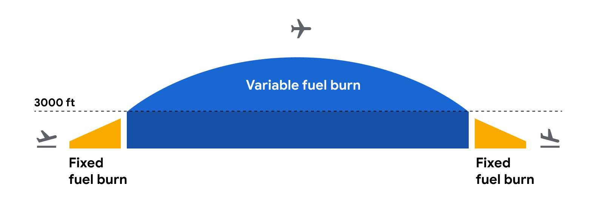

## Travel Impact Model 1.9.1

#### (Implementation of the Travalyst Shared Framework by Google)

## Table of contents

*   [Background](#background)
*   [Model overview](#model-overview)
    *   [Flight level emission estimates](#flight-level-emission-estimates)
        *   [Flight level CO2 estimates](#flight-level-co2-estimates)
        *   [Data sources](#data-sources)
    *   [Breakdown from flight level to individual level](#breakdown-from-flight-level-to-individual-level)
        *   [Data sources](#data-sources-1)
        *   [Outlier detection and basic correctness checking](#outlier-detection-and-basic-correctness-checking)
        *   [Factors details](#factors-details)
*   [Example emission estimation](#example-emission-estimation)
*   [Legal base for model data sharing](#legal-base-for-model-data-sharing)
*   [API access](#api-access)
*   [Versioning](#versioning)
*   [Changelog](#changelog)
*   [Limitations](#limitations)
*   [Data quality](#data-quality)
*   [Contact](#contact)
*   [Glossary](#glossary)
*   [Appendix](#appendix)
    *   [Appendix A: Aircraft type support](#appendix-a-aircraft-type-support)

## Background

In this document we describe the modeling assumptions and input specifications
behind the Travel Impact Model (TIM), a state of the art emission estimation
model that Google’s Travel Sustainability team has compiled from several
external data sources. The TIM aims at predicting carbon emissions for future
flights to help travelers plan their travel.

## Model overview

For each flight, the TIM considers several factors, such as the Great Circle
distance between the origin and destination airports and the aircraft type being
used for the route. Actual carbon emissions at flight time may vary depending on
factors not known at modeling time, such as speed and altitude of the aircraft,
the actual flight route, and weather conditions at the time of flight.

### Flight level emission estimates

#### Flight level CO2 estimates

The Travel Impact Model estimates fuel burn based on the Tier 3 methodology for
emission estimates from the
[Annex 1.A.3.a Aviation 2019](https://www.eea.europa.eu/publications/emep-eea-guidebook-2019/part-b-sectoral-guidance-chapters/1-energy/1-a-combustion/1-a-3-a-aviation/view)
published by the European Environment Agency (EEA).

There are several resources about the EEA model available:

*   the main
    [documentation](https://www.eea.europa.eu/publications/emep-eea-guidebook-2019/part-b-sectoral-guidance-chapters/1-energy/1-a-combustion/1-a-3-a-aviation/view)
*   the
    [data set](https://www.eea.europa.eu/publications/emep-eea-guidebook-2019/part-b-sectoral-guidance-chapters/1-energy/1-a-combustion/1-a-3-a-aviation-1/view)
*   further
    [documentation](https://www.eurocontrol.int/sites/default/files/content/documents/201807-european-aviation-fuel-burn-emissions-system-eea-v2.pdf)
    on pre-work for the EEA model

Additionally, the Travel Impact Model updates the fuel burn to emissions
conversion factor to align with the
[ISO 14083](https://www.iso.org/standard/78864.html) Fuel Heat Combustion factor
and
[CORSIA Life Cycle Assessment](https://www.icao.int/environmental-protection/CORSIA/Documents/CORSIA_Eligible_Fuels/CORSIA_Supporting_Document_CORSIA%20Eligible%20Fuels_LCA_Methodology_V5.pdf),
and breaks down emissions estimates into Well-to-Tank (WTT) and Tank-to-Wake
(TTW) emissions.

Tank-to-Wake emissions account for emissions produced by burning jet fuel during
flying, take-off and landing. Well-to-Tank emissions account for emissions
generated during the production, processing, handling and delivery of jet fuel.
Well-to-Wake (WTW) emissions is the sum of Well-to-Tank (WTT) and Tank-to-Wake
(TTW) emissions.

The EEA model takes the efficiency of the aircraft into account. As shown in
Figure 1, a typical flight is modeled in two stages: *take off and landing*
(LTO, yellow) and *cruise, climb, and descend* (CCD, blue).

(Fig 1)

For each stage, there are aircraft-specific and distance-specific fuel burn
estimates. Table 1 shows an example fuel burn forecast for a Boeing 787-9 (B789)
aircraft:

<table>
  <tr>
   <td style="background-color: null"><code>Aircraft</code>
   </td>
   <td style="background-color: null"><code>Distance (nm)</code>
   </td>
   <td style="background-color: null"><code>LTO fuel forecast (kg)</code>
   </td>
   <td style="background-color: null"><code>CCD fuel forecast (kg)</code>
   </td>
  </tr>
  <tr>
   <td style="background-color: null"><code>B789</code>
   </td>
   <td style="background-color: null"><code>500</code>
   </td>
   <td style="background-color: null"><code>1,727</code>
   </td>
   <td style="background-color: null"><code>5,815</code>
   </td>
  </tr>
  <tr>
   <td style="background-color: null"><code>B789</code>
   </td>
   <td style="background-color: null"><code>1000</code>
   </td>
   <td style="background-color: null"><code>1,727</code>
   </td>
   <td style="background-color: null"><code>10,770</code>
   </td>
  </tr>
  <tr>
   <td style="background-color: null"><code>B789</code>
   </td>
   <td style="background-color: null"><code>...</code>
   </td>
   <td style="background-color: null"><code>...</code>
   </td>
   <td style="background-color: null"><code>...</code>
   </td>
  </tr>
  <tr>
   <td style="background-color: null"><code>B789</code>
   </td>
   <td style="background-color: null"><code>5000</code>
   </td>
   <td style="background-color: null"><code>1,727</code>
   </td>
   <td style="background-color: null"><code>52,375</code>
   </td>
  </tr>
  <tr>
   <td style="background-color: null"><code>B789</code>
   </td>
   <td style="background-color: null"><code>5500</code>
   </td>
   <td style="background-color: null"><code>1,727</code>
   </td>
   <td style="background-color: null"><code>57,430</code>
   </td>
  </tr>
</table>

(Table 1)

By using these numbers together with linear interpolation or extrapolation, it
is possible to deduce the emission estimate for flights of any length on
supported aircraft:

*   Interpolation is used for flights that are in between two distance data
    points. As a theoretical example, a 5250 nautical miles flight on a Boeing
    787-9 will burn approximately 54902.5 kg of fuel during the CCD phase (where
    54902.5 equals 52375 + (57430 - 52375)/2, with figures for 5000nm and 5500nm
    taken from Table 1).
*   Extrapolation is used for flights that are either shorter than the smallest
    supported distance, or longer than the longest supported distance for that
    aircraft type.
*   The Lower Heating Value from ISO 14083 (43.1 MJ/kg averaged over US and EU
    numbers from [source](https://www.iso.org/standard/78864.html) Table I1 and
    Table I2) and CORSIA Carbon Intensity value (74 gCO2e/MJ from
    [source](https://www.icao.int/environmental-protection/CORSIA/Documents/CORSIA_Eligible_Fuels/CORSIA_Supporting_Document_CORSIA%20Eligible%20Fuels_LCA_Methodology_V5.pdf)
    Table 5) are used to calculate the jet fuel combustion to CO2
    conversion factor of 3.1894. The CORSIA Life Cycle Assessment methodology is
    used to calculate a WTT CO2e emissions factor of 0.6465 (WTT 15g
    CO2e/MJ added to the TTW 74 gCO2e/MJ Carbon Intensity
    to total up to the WTW lifecycle Carbon Intensity of 89 gCO2e/MJ
    from
    [source](https://www.icao.int/environmental-protection/CORSIA/Documents/CORSIA_Eligible_Fuels/CORSIA_Supporting_Document_CORSIA%20Eligible%20Fuels_LCA_Methodology_V5.pdf)
    page 22 and Table 7). The factors used are as follows:

<table>
  <tr>
   <td style="background-color: null"><code>kg CO2e/kg of A1 jet fuel burn</code>
   </td>
   <td style="background-color: null"><code>TTW [kg CO2e/kg]</code>
   </td>
   <td style="background-color: null"><code>WTT [kg CO2e/kg]</code>
   </td>
   <td style="background-color: null"><code>WTW [kg CO2e/kg]</code>
   </td>
  </tr>
  <tr>
   <td style="background-color: null"><code>CORSIA and ISO</code>
   </td>
   <td style="background-color: null"><code>3.1894</code>
   </td>
   <td style="background-color: null"><code>0.6465</code>
   </td>
   <td style="background-color: null"><code>3.8359</code>
   </td>
  </tr>
</table>

CO2e is short for CO2 equivalent and includes Kyoto Gases
(GHG) as described
[here](https://ec.europa.eu/eurostat/statistics-explained/index.php?title=Glossary:Kyoto_basket#:~:text=The%20Kyoto%20basket%20encompasses%20the,sulphur%20hexafluoride%20\(SF6\)).
Warming effects produced by short-lived climate pollutants (such as
contrail-induced cirrus clouds) are not yet included in CO2e as
calculated by the Travel Impact Model.

There is information for most commonly-used aircraft types in the EEA data, but
some are missing. For missing aircraft types, one of the following alternatives
is applied in ranked order:

*   *Supported using the Piano-X data set:* If an aircraft type is supported in
    the Piano-X data set and a comparable type is supported both in the Piano-X
    and the EEA data set, a correction factor is derived by comparing the
    Piano-X output for both types across a range of missions. The correction
    factor will be applied to the LTO and CCD numbers of the comparable type in
    the EEA database.
*   *Supported by fallback to non-optimized aircraft type:* If there are
    estimates in the EEA data set for an aircraft that is identical except for
    the lack of optimizations such as winglets or sharklets, the non-optimized
    counterpart is used for the estimate.
*   *Supported by fallback to previous generation aircraft type:* If there are
    estimates in the EEA data set for a previous generation aircraft type in the
    same family, from the same manufacturer, the previous generation aircraft is
    used for the estimate.
*   *Supported by fallback to least efficient aircraft in the family:* For
    umbrella codes that refer to a group of aircraft, the least efficient
    aircraft in the family will be assumed.
*   *Not supported:* For aircraft types for which none of the cases above apply,
    there are no emissions estimates available.

See [Appendix A](#bookmark=id.pbnw7e5sw0vi) for a table with detailed
information about aircraft type support status.

#### Data sources

Used for flight level emissions:

*   EEA Report No 13/2019 1.A.3.a Aviation 1 Master emissions calculator 2019
    ([link](https://www.eea.europa.eu/publications/emep-eea-guidebook-2019/part-b-sectoral-guidance-chapters/1-energy/1-a-combustion/1-a-3-a-aviation-1/view))
*   Piano-X aircraft database ([link](https://www.lissys.uk/PianoX.html))
*   CORSIA Eligible Fuels Life Cycle Assessment Methodology
    ([link](https://www.icao.int/environmental-protection/CORSIA/Documents/CORSIA_Eligible_Fuels/CORSIA_Supporting_Document_CORSIA%20Eligible%20Fuels_LCA_Methodology_V5.pdf))
*   ISO 14083 ([link](https://www.iso.org/standard/78864.html))

### Breakdown from flight level to individual level

In addition to predicting a flight’s emissions, it is possible to estimate the
emissions for an individual seat on that flight. To perform this estimate, it’s
necessary to perform an individual breakdown based on three relevant factors:

1.  Number of total seats on the plane in each seating class (first, business,
    premium economy, economy)
2.  Number of occupied seats on the plane
3.  Amount of cargo being carried

The emission estimates are higher for premium economy, business and first
seating classes because the seats in these sections take up more space. As a
result, those seats account for a larger share of the flight's total emissions.
Different space allocations on narrow and wide-body aircraft are considered
using separate weighing factors.

#### Data sources

Used to determine which aircraft type was used for a given flight:

*   Aircraft type from published flight schedules

Used to determine seating configuration and calculate emissions per available
seat:

*   Aircraft Configuration/Version (ACV) from published flight schedules
*   Fleet-level aircraft configuration information from the "Seats (Equipment
    Configuration) File" provided by [OAG](https://oag.com)

#### Primary fallback for missing seat configuration

If there are no individual seat configuration numbers for a flight available
from the published flight schedules, we query the fleet-level seating data for a
unique match by carrier and aircraft. This is only possible in cases where a
carrier uses the same seating configuration for all their aircraft of a certain
aircraft model.

#### Outlier detection and basic correctness checking

If there are no individual seat configuration numbers for a flight available
from the published flight schedules, nor from the fleet-level data, or if they
are incorrectly formatted or implausible, the TIM uses aircraft-specific medians
derived from the overall dataset instead. Basic correctness checks based on
reference seat configurations for the aircraft are performed, specifically:

*   The *calculated total seat area* for a flight is the total available seating
    area. This is calculated based on seating data and seating class factors.
    For example, the total seat area for a wide-body aircraft would be:
    *   `1.0 * num_economy_class_seats +`
         `1.5 * num_premium_economy_class_seats +`
         `4.0 * num_business_class_seats +`
         `5.0 * num_first_class_seats`
*   The *reference total seat area* for an aircraft is roughly the median total
    seat area.
*   During a *comparison* step: If the *calculated total seat area* for a given
    flight is within certain boundaries of the reference for that aircraft, the
    filed seating data from published flight schedules is used. Otherwise the
    *reference total seat area* is used.

#### Factors details

**Seating class factors**

Seating parameters follow
[IATA RP 1726](https://www.iata.org/en/programs/environment/passenger-emissions-methodology/).
An analysis of seat pitch and width in each seating class in typical plane
configurations confirmed the accuracy of these factors.

*   Narrow-body aircraft
    *   Economy and Premium Economy **1**
    *   Business and First **1.5**
*   Wide-body aircraft
    *   Economy **1**
    *   Premium Economy **1.5**
    *   Business **4**
    *   First **5**

**Load factors**

Passenger load factors are predicted based on historical passenger statistics.
TIM uses a tiered approach to determine passenger load factors. High resolution,
specific data (i.e. by route) is preferred where available, and in the absence
of more granular data, the model falls back to a generic value (i.e. global
default).

Tier 1: Highly specific passenger load factors

1.  For flights within, to, and from the United States and its territories, we
    consider the T-100 historical dataset from the
    [US Department of Transportation Bureau of Transportation Statistics](https://www.bts.gov/airline-data-downloads)
    (see below for more details).

    *   When the data is available for a given carrier, route, and month of
        travel, we calculate the aggregate passenger load factors, looking back
        up to six years.
    *   When the data is available for a given carrier and month of travel, but
        not the specific route, we use the average passenger load factor across
        all the routes, up to six years back.
    *   If fewer than three years of data are available, we consider ch-aviation
        load factors described below.

2.  For all other flights, we consider the historical load factor data provided
    by [ch-aviation](https://www.ch-aviation.com/):

    *   When the data is available for a given carrier and month of travel, we
        calculate the aggregate passenger load factors, looking back up to six
        years.
    *   If fewer than three years of data are available, we use the global
        average fallback value instead as described below (\"*Global default
        passenger load factor*\").

Tier 2: Global default passenger load factor

*   For all other flights for which an equivalent public-domain dataset with
    similar granularity is not currently available, TIM falls back to use a load
    factor value of **84.5%**. This value is derived from
    [historical data for the U.S.](https://fred.stlouisfed.org/series/LOADFACTOR)
    from 2019.
*   An analysis of load factors sourced from publicly available airline investor
    reports indicates that this value is a good approximation for the passenger
    load factor globally.

Cargo load factors are not included.

**Load factor data source specifics**

T-100 from
[U.S. Department of Transportation Bureau of Transportation Statistics](https://www.bts.gov/airline-data-downloads)
and [ch-aviation](https://www.ch-aviation.com/)

*   Only data from the last six years is used.
*   Data is updated on a monthly basis (TIM version number will not increase).
*   Any month of data for which the overall load factor (aggregated over all
    airlines and routes) differs more than 10% from the average load factor
    since 2017 is removed as an outlier month. March 2020–February 2022
    (inclusive) are removed from the data as a result.
*   To account for patterns of seasonality that do not correspond with the exact
    month of travel (e.g. public holidays), the previous and next month are
    taken into account for the average load factor of any given month of travel.
    E.g. For future flights in March, we aggregate over all flights in February,
    March, and April.

## Example emission estimation

Let’s consider the following flight parameters:

*   Origin: Zurich ZRH
*   Destination: San Francisco SFO
*   Aircraft: Boeing 787-9
    *   Economy seats: 188
    *   Premium Economy seats: 21
    *   Business seats: 48
    *   First seats: 0

To get the total emissions for a flight, let’s follow the process below:

1.  Calculate great circle distance between ZRH and SFO: 9369 km (= 5058.9
    nautical miles)
2.  Look up the static LTO numbers and the distance-based CCD number from
    aircraft performance data (see Table 1), and interpolate fuel burn for a
    9369 km long flight:
    *   LTO 1727 kg of fuel burn
    *   CCD 52970 kg of fuel burn calculated
        *   52375 + (5058.9 - 5000) * (57430 - 52375) / (5500 - 5000) = 52970
3.  Sum LTO and CCD number for total flight-level result:
    *   1727 kg + 52970 kg = 54697 kg of fuel burn
4.  Convert from fuel burn to CO2e emissions for total flight-level
    result:
    *   Well-to-Tank (WTT) emissions in kg of CO2e: 54697 * 0.6465 =
        35362
    *   Tank-to-Wake (TTW) emissions in kg of CO2e: 54697 * 3.1894 =
        174451
    *   Well-to-Wake (WTW) emissions in kg of CO2e: (54697 *
        0.6465) + (54697 * 3.1894) = 209812

Once the total flight emissions are computed, let’s compute the per passenger
break down:

1.  Determine which seating class factors to use for the given flight. In the
    ZRH-SFO example, we will use the wide-body factors (Boeing 787-9).
2.  Calculate the equivalent capacity of the aircraft according to the following
    \
    C = first\_class\_seats \* first\_class\_multiplier + business\_class\_seats
    \* business\_class\_multiplier + …
    *   In this specific example, the estimated area is: \
        0 \* 5 + 48 \* 4 + 1.5 \* 21 + 188 \* 1 = 411.5
3.  Divide the total CO2e emissions by the equivalent capacity
    calculated above to get the CO2e emissions per economy passenger.
    *   Well-to-Tank (WTT) emissions in kg of CO2e: 35362 / 411.5 =
        85.934
    *   Tank-to-Wake (TTW) emissions in kg of CO2e: 174451 / 411.5 =
        423.939
    *   Well-to-Wake (WTW) emissions in kg of CO2e: 85.934 +
        423.939 = 509.873
4.  Emissions per passenger for other cabins can be derived by multiplying by
    the corresponding cabin factor.
    *   First:
        *   Well-to-Tank (WTT) emissions in kg of CO2e: 85.934 * 5 =
            429.67
        *   Tank-to-Wake (TTW) emissions in kg of CO2e: 423.939 * 5 =
            2119.695
        *   Well-to-Wake (WTW) emissions in kg of CO2e: 509.873 * 5 =
            2549.365
    *   Business:
        *   Well-to-Tank (WTT) emissions in kg of CO2e: 85.934 * 4 =
            343.736
        *   Tank-to-Wake (TTW) emissions in kg of CO2e: 423.939 * 4 =
            1695.756
        *   Well-to-Wake (WTW) emissions in kg of CO2e: 509.873 * 4 =
            2039.492
    *   Premium Economy:
        *   Well-to-Tank (WTT) emissions in kg of CO2e: 85.934 *
            1.5 = 128.901
        *   Tank-to-Wake (TTW) emissions in kg of CO2e: 423.939 *
            1.5 = 635.909
        *   Well-to-Wake (WTW) emissions in kg of CO2e: 509.873 *
            1.5 = 764.81
    *   Economy:
        *   Well-to-Tank (WTT) emissions in kg of CO2e: 85.934
        *   Tank-to-Wake (TTW) emissions in kg of CO2e: 423.939
        *   Well-to-Wake (WTW) emissions in kg of CO2e: 509.873
5.  Scale to estimated load factor 0.845 by apportioning emissions to occupied
    seats:
    *   First:
        *   Well-to-Tank (WTT) emissions in kg of CO2e: 429.67 /
            0.845 = 508.485
        *   Tank-to-Wake (TTW) emissions in kg of CO2e: 2119.695 /
            0.845 = 2508.515
        *   Well-to-Wake (WTW) emissions in kg of CO2e: 2549.365 /
            0.845 = 3017
    *   Business:
        *   Well-to-Tank (WTT) emissions in kg of CO2e: 343.736 /
            0.845 = 406.788
        *   Tank-to-Wake (TTW) emissions in kg of CO2e: 1695.756 /
            0.845 = 2006.812
        *   Well-to-Wake (WTW) emissions in kg of CO2e: 2039.492 /
            0.845 = 2413.6
    *   Premium Economy:
        *   Well-to-Tank (WTT) emissions in kg of CO2e: 128.901 /
            0.845 = 152.546
        *   Tank-to-Wake (TTW) emissions in kg of CO2e: 635.909 /
            0.845 = 752.555
        *   Well-to-Wake (WTW) emissions in kg of CO2e: 764.81 /
            0.845 = 905.101
    *   Economy:
        *   Well-to-Tank (WTT) emissions in kg of CO2e: 85.934 /
            0.845 = 101.697
        *   Tank-to-Wake (TTW) emissions in kg of CO2e: 423.939 /
            0.845 = 501.703
        *   Well-to-Wake (WTW) emissions in kg of CO2e: 509.873 /
            0.845 = 603.4

Note that the model generates emission estimates for all cabin classes,
including cabin classes where the seat count is zero, as cabin classifications
are not always consistent across data providers. Therefore, providing estimates
for all cabin classes simplifies integration of TIM data with other datasets.

## Legal base for model data sharing

The carbon emission estimate data are available via API under the
[Creative Commons Attribution-ShareAlike CC BY-SA 4.0](https://creativecommons.org/licenses/by-sa/4.0/)
open source license
([legal code](https://creativecommons.org/licenses/by-sa/4.0/legalcode)).

## API access

Developer documentation is available on the Google Developers site for the
[Travel Impact Model API](https://developers.google.com/travel/impact-model).

## Versioning

The model will be developed further over time, e.g. with improved load factors
methodology or more fine grained seat area ratios calculation. New versions will
be published.

A full model version will have four components: **MAJOR.MINOR.PATCH.DATE**, e.g.
1.3.1.20230101. The four tiers of change tracking are handled differently:

*   **Major versions**: Changes to the model that would break existing client
    implementations if not addressed (e.g. changes in data types or schema) or
    major methodology changes (e.g. adding new data sources to the model that
    lead to major output changes). We expect these to be infrequent but they
    need to be managed with special care.
*   **Minor versions**: Changes to the model that, while being consistent across
    schema versions, change the model parameters or implementation.
*   **Patch versions**: Implementation changes meant to address bugs or
    inaccuracies in the model implementation.
*   **Dated versions**: Model datasets are recreated with refreshed input data
    but no change to the algorithms regularly.

## Changelog

### 1.9.1

Expanding T-100 coverage to include US territories. See
[section on load factors](#factors-details) for information on the T-100
dataset.

### 1.9.0

Adding carrier-level passenger load factors from
[ch-aviation](https://www.ch-aviation.com/) for flights that are not already
covered by the T-100 dataset from the
[US Department of Transportation Bureau of Transportation Statistics](https://www.bts.gov/airline-data-downloads).
Also adjusting the load factors outlier exclusion criteria from 20% to 10%
deviation from average load factor since 2017, resulting in removing March
2020–February 2022 (inclusive) (previously March 2020–February 2021). See the
[section on load factors](#factors-details) for more details.

### 1.8.0

Adding Well-to-Tank (WTT) and Tank-to-Wake (TTW) emissions break-downs to all
flight emissions. Updating the jet fuel combustion to CO2 conversion
factor from the minimum value of 3.1672 to the value of 3.1894 (using Lower
Heating Value from ISO 14083 and CORSIA Carbon Intensity value), and using the
CORSIA Life Cycle Assessment methodology to implement a WTT CO2e
emissions factor 0.6465. Reference:
[ISO](https://www.iso.org/standard/78864.html),
[CORSIA](https://www.icao.int/environmental-protection/CORSIA/Documents/CORSIA_Eligible_Fuels/CORSIA_Supporting_Document_CORSIA%20Eligible%20Fuels_LCA_Methodology_V5.pdf).

### 1.7.0

Updating the jet fuel combustion to CO2 conversion factor from 3.15
based on the EEA methodology to 3.1672 to align with the
[CORSIA methodology’s](https://www.icao.int/environmental-protection/CORSIA/Documents/CORSIA_Eligible_Fuels/CORSIA_Supporting_Document_CORSIA%20Eligible%20Fuels_LCA_Methodology_V5.pdf)
recommended factor.

### 1.6.0

Adding carrier and route specific passenger load factors for flights from, to,
and within the U.S., taking seasonality patterns into account. We are using data
from the
[U.S. Department of Transportation Bureau of Transportation Statistics](https://www.bts.gov/).
For more details, see the [section on load factors](#factors-details).

### 1.5.1

Adding a fleet-level source for seating configuration data. For airlines that
don't file seating configuration information in flight schedules but use the
same seating configuration for all their aircraft of a certain model, a fall
back to the "Seats (Equipment Configuration) File" provided by OAG is performed.

### 1.5.0

Following recent discussions with academic and industry partners, we are
adjusting the TIM to focus on CO2 emissions. While we strongly
believe in including non-CO2 effects in the model long-term, the
details of how and when to include these factors requires more input from our
stakeholders as part of a governance model that’s in development. With this
change, we are provisionally removing contrails effects from our CO2e
estimates but will keep the labeling as “CO2e” in the model to ensure
future compatibility.

We believe CO2e factors are critical to include in the model, given
the emphasis on them in the IPCC’s AR6 report. We want to make sure that when we
do incorporate them into the model, we have a strong plan to account for time of
day and regional variations in contrails’ warming impact. We are committed to
providing consumers the most accurate information as they make informed choices
about their travel options.

We continue to invest into research and collaborate with leading scientists,
NGOs, and partners to better incorporate contrails and other non-GHG impact into
our model, and we look forward to sharing updates at a later date.

### 1.4.0

Initial public version of the Travel Impact Model.

## Limitations

The model described in this document produces estimates of carbon emissions.
Emission estimates aim to be representative of what the typical emissions for a
flight matching the model inputs would be. Estimates might differ from actual
emissions based on a number of factors.

**Actual flight distances:** When modeling the distance between a given origin
and destination, the Great Circle Distance between the origin and destination
airport is used, as opposed to the actual distance flown.

This simplifying assumption enables the model to be used even when precise
flight path information is not available, such as when computing emission
estimates for future flights.

**Aircraft types:** The emissions model accounts for the equipment type as
published in the flight schedules. The majority of aircraft types in use are
covered. See [Appendix A](#appendix-a-aircraft-type-support) for a list of
supported aircraft types.

Some aircraft types are supported by falling back to a related model thought to
have comparable emissions. See
[Flight level emission estimates](#flight-level-emission-estimates) for more
details.

If no reasonable approximation is available for a given aircraft, the model will
not produce estimates for it.

**Cargo load factors:** Cargo load is not yet supported in the model.

**Engine information:** Beyond the aircraft type, there are other aircraft
characteristics that can have an effect on the flight emissions (e.g. engine
type, engine age, etc.) that are not currently included when computing emission
estimates.

**Fuel type:** The emissions model assumes that all flights operate on 100%
conventional fuel. Alternative fuel types (e.g. Sustainable Aviation Fuel) are
not supported.

**Seat configurations:** If there are no seat configurations individual numbers
for a flight available from published flight schedules, or if they are
incorrectly formatted or implausible, aircraft specific medians derived from the
overall dataset are employed.

**Contrail-induced cirrus clouds:** Warming effects produced by short-lived
climate pollutants such as contrail-induced cirrus clouds are not yet included
in emissions as calculated by the Travel Impact Model.

## Data quality

The CO2 estimates were validated by comparing against a limited
amount of real-world fuel burn data. The finding was that the TIM is
underestimating by 7% on average.

The
[EEA guidebook](https://www.eea.europa.eu/publications/emep-eea-guidebook-2019/part-b-sectoral-guidance-chapters/1-energy/1-a-combustion/1-a-3-a-aviation/view)
(chapter 4) cites sources from ICAO that estimate the uncertainty of the LTO
factors between 5 and 10%. The CCD factor uncertainty is estimated between 15
and 40%.

## Contact

We are welcoming feedback and enquiries. Please get in touch using this
[form](https://support.google.com/travel/contact/tim?pcff=category:travel_impact_model_\(TIM\)_specifications).

## Glossary

**CCD:** The flight phases *Climb*, *Cruise*, *and* *Descend* occur above a
flight altitude of 3,000 feet.

**CO2**: Carbon dioxide is the most significant long-lived greenhouse
gas in Earth's atmosphere. Since the Industrial Revolution anthropogenic
emissions – primarily from use of fossil fuels and deforestation – have rapidly
increased its concentration in the atmosphere, leading to global warming.

**CO2e**: CO2e is short for CO2 equivalent, and
is a metric measure used to compare the emissions from various greenhouse gases
on the basis of their global-warming potential (GWP), by converting amounts of
other gases to the equivalent amount of carbon dioxide with the same global
warming potential
([source](https://ec.europa.eu/eurostat/statistics-explained/index.php?title=Glossary:Carbon_dioxide_equivalent)).

**Contrail-induced cirrus clouds**: Cirrus clouds are atmospheric clouds that
look like thin strands. There are natural cirrus clouds, and also contrail
induced cirrus clouds that under certain conditions occur as the result of a
contrail formation from aircraft engine exhaust.

**CORSIA**: Carbon Offsetting and Reduction Scheme for International Aviation, a
carbon offset and reduction scheme to curb the aviation impact on climate change
developed by the International Civil Aviation Organization.

**Effective Radiative Forcing (ERF):** Radiative forcing effects can create
rapid responses in the troposphere, which can either enhance or reduce the flux
over time, and makes RF a difficult proxy for calculating long-term climate
effects. ERF attempts to capture long-term climate forcing, and represents the
change in net radiative flux after allowing for short-term responses in
atmospheric temperatures, water vapor and clouds.

**European Environment Agency (EEA):** An agency of the European Union whose
task is to provide sound, independent information on the environment.

**Google’s Travel Sustainability team**: A team at Google focusing on travel
sustainability, based in Zurich (Switzerland) and Cambridge (U.S.), with the
goal to enable users to make more sustainable travel choices.

**Great circle distance:** Defined as the shortest distance between two points
on the surface of a sphere when measured along the surface of the sphere.

**ICAO:** The International Civil Aviation Organization, a specialized agency of
the United Nations.

**ISO 14083**: The international standard that establishes a common methodology
for the quantification and reporting of greenhouse gas (GHG) emissions arising
from the operation of transport chains of passengers and freight
([source](https://www.iso.org/standard/78864.html)), published by the
International Organization for Standardization (ISO).

**LTO:** The flight phases *Take Off and Landing* occur below a flight altitude
of 3000 feet at the beginning and the end of a flight. They include the
following phases: taxi-out, taxi-in (idle), take-off, climb-out, approach and
landing.

**Radiative Forcing (RF):** Radiative Forcing is the instantaneous difference in
radiative energy flux stemming from a climate perturbation, measured at the top
of the atmosphere.

**Short Lived Climate Pollutants (SLCPs):** Pollutants that stay in the
atmosphere for a short time (e.g. weeks) in comparison to Long Lived Climate
Pollutants such as CO2 that stay in the atmosphere for hundreds of
years.

**Tank-to-Wake
(TTW):** Emissions produced by burning jet fuel during takeoff, flight, and
landing of an aircraft.

**TIM:** The Travel Impact Model described in this document.

**Well-to-Tank
(WTT):** Emissions generated during the production, processing, handling, and
delivery of jet fuel.

**Well-to-Wake
(WTW):** The sum of Well-to-Tank (WTT) and Tank-to-Wake (TTW) emissions.

## Appendix

### Appendix A: Aircraft type support

Aircraft full name                              | IATA aircraft code | Mapping (ICAO aircraft code) | Support status
----------------------------------------------- | ------------------ | ---------------------------- | --------------
Airbus A220-100                                 | 221                |                              | Supported via correction factor derived from Piano data
Airbus A220-300                                 | 223                |                              | Supported via correction factor derived from Piano data
Airbus A300-600 Freighter                       | ABY                | A306                         | Direct match in EEA
Airbus A300-600/600C                            | AB6                | A306                         | Direct match in EEA
Airbus A300B2/B4/C4                             | AB4                | A30B                         | Direct match in EEA
Airbus A310                                     | 310                | A310                         | Direct match in EEA
Airbus A310-300                                 | 313                | A310                         | Direct match in EEA
Airbus A318                                     | 318                | A318                         | Direct match in EEA
Airbus A318/A319/A320/A321                      | 32S                | A321                         | Mapped to least efficient in family
Airbus A319                                     | 319                | A319                         | Direct match in EEA
Airbus A320-100/200                             | 320                | A320                         | Direct match in EEA
Airbus A320neo                                  | 32N                |                              | Supported via correction factor derived from Piano data
Airbus A321                                     | 321                | A321                         | Direct match in EEA
Airbus A321neo                                  | 32Q                |                              | Supported via correction factor derived from Piano data
Airbus A330                                     | 330                | A332                         | Mapped to least efficient in family
Airbus A330-200                                 | 332                | A332                         | Direct match in EEA
Airbus A330-300                                 | 333                | A333                         | Direct match in EEA
Airbus A330-900neo                              | 339                | A333                         | Supported via correction factor derived from Piano data
Airbus A340                                     | 340                | A345                         | Mapped to least efficient in family
Airbus A340-300                                 | 343                | A343                         | Direct match in EEA
Airbus A340-500                                 | 345                | A345                         | Direct match in EEA
Airbus A340-600                                 | 346                | A346                         | Direct match in EEA
Airbus A350                                     | 350                | A350                         | Mapped to least efficient in family
Airbus A350-900                                 | 359                | A350                         | Direct match in EEA
Airbus A380                                     | 380                | A380                         | Mapped to least efficient in family
Airbus A380-800                                 | 388                | A380                         | Direct match in EEA
Airbus A320 (Sharklets)                         | 32A                |                              | Supported via correction factor derived from Piano data
Airbus A321 (Sharklets)                         | 32B                |                              | Supported via correction factor derived from Piano data
Airbus A350-1000                                | 351                | A350                         | Supported via correction factor derived from Piano data
Antonov AN-148-100                              | A81                | AN148                        | Direct match in EEA
Antonov AN-24                                   | AN4                | AN24                         | Direct match in EEA
Antonov AN-26/30/32                             | AN6                | AN32                         | Mapped to least efficient in family
Antonov AN-32                                   | A32                | AN32                         | Direct match in EEA
ATR 42-300/320                                  | AT4                | ATR42                        | Mapped to similar model
ATR 42-500                                      | AT5                | ATR42                        | Direct match in EEA
ATR 42/ATR 72                                   | ATR                | ATR72                        | Mapped to least efficient in family
ATR 72                                          | AT7                | ATR72                        | Direct match in EEA
Avro Regional Jet Avroliner                     | ARJ                |                              | Not supported
Avro Regional Jet RJ100 Avroliner               | AR1                |                              | Not supported
Avro Regional Jet RJ85 Avroliner                | AR8                |                              | Not supported
Beechcraft 1900                                 | BE1                |                              | Not supported
Beechcraft 1900/1900C                           | BES                |                              | Not supported
Beechcraft 1900D                                | BEH                |                              | Not supported
Beechcraft C99 Airliner                         | BE9                |                              | Not supported
Beechcraft Light Aircraft twin engine           | BET                |                              | Not supported
Boeing 717-200                                  | 717                | B717                         | Direct match in EEA
Boeing 737                                      | 737                | B734                         | Mapped to least efficient in family
Boeing 737 Freighter                            | 73F                | B734                         | Mapped to least efficient in family
Boeing 737-200                                  | 732                | B732                         | Direct match in EEA
Boeing 737-200                                  | 73M                | B732                         | Direct match in EEA
Boeing 737-200/200 Advanced                     | 73S                | B732                         | Direct match in EEA
Boeing 737-300                                  | 733                | B733                         | Direct match in EEA
Boeing 737-300                                  | 73N                | B733                         | Direct match in EEA
Boeing 737-300 (winglets)                       | 73C                | B733                         | Mapped to non-optimized aircraft
Boeing 737-400                                  | 734                | B734                         | Direct match in EEA
Boeing 737-400                                  | 73Q                | B734                         | Direct match in EEA
Boeing 737-500                                  | 735                | B735                         | Direct match in EEA
Boeing 737-500 (winglets)                       | 73E                | B735                         | Mapped to non-optimized aircraft
Boeing 737-600                                  | 736                | B736                         | Direct match in EEA
Boeing 737-700                                  | 73G                | B737                         | Direct match in EEA
Boeing 737-700 (winglets)                       | 73W                |                              | Supported via correction factor derived from Piano data
Boeing 737-800                                  | 738                | B738                         | Direct match in EEA
Boeing 737-800 (Scimitar Winglets)              | 7S8                |                              | Supported via correction factor derived from Piano data
Boeing 737-800 (winglets)                       | 73H                |                              | Supported via correction factor derived from Piano data
Boeing 737-900                                  | 739                | B739                         | Direct match in EEA
Boeing 737-900 (winglets)                       | 73J                | B739                         | Mapped to non-optimized aircraft
Boeing 737MAX 8                                 | 7M8                |                              | Supported via correction factor derived from Piano data
Boeing 737MAX 9                                 | 7M9                |                              | Supported via correction factor derived from Piano data
Boeing 747                                      | 747                | B744                         | Mapped to least efficient in family
Boeing 747 Freighter                            | 74F                | B744                         | Mapped to least efficient in family
Boeing 747-400                                  | 744                | B744                         | Direct match in EEA
Boeing 747-400 Mixed                            | 74E                | B744                         | Direct match in EEA
Boeing 747-400F Freighter                       | 74Y                | B744                         | Direct match in EEA
Boeing 747-8F (Freighter)                       | 74N                | B744                         | Mapped onto older model
Boeing 747-8I                                   | 74H                | B744                         | Mapped onto older model
Boeing 757                                      | 757                | B753                         | Mapped to least efficient in family
Boeing 757-200                                  | 752                | B752                         | Direct match in EEA
Boeing 757-200 (winglets)                       | 75W                |                              | Supported via correction factor derived from Piano data
Boeing 757-300                                  | 753                | B753                         | Direct match in EEA
Boeing 757-300 (winglets)                       | 75T                | B753                         | Mapped to non-optimized aircraft
Boeing 767                                      | 767                | B764                         | Mapped to least efficient in family
Boeing 767-200                                  | 762                | B762                         | Direct match in EEA
Boeing 767-300                                  | 763                | B763                         | Direct match in EEA
Boeing 767-300 (winglets)                       | 76W                |                              | Supported via correction factor derived from Piano data
Boeing 767-400                                  | 764                | B764                         | Direct match in EEA
Boeing 777                                      | 777                | B773                         | Mapped to least efficient in family
Boeing 777 Freighter                            | 77F                | B773                         | Mapped to least efficient in family
Boeing 777-200/200ER                            | 772                | B772                         | Direct match in EEA
Boeing 777-200F Freighter                       | 77X                | B772                         | Direct match in EEA
Boeing 777-200LR                                | 77L                | B772                         | Mapped to similar model
Boeing 777-300                                  | 773                | B773                         | Direct match in EEA
Boeing 777-300ER                                | 77W                | B77W                         | Direct match in EEA
Boeing 787                                      | 787                | B789                         | Mapped to least efficient in family
Boeing 787-10                                   | 781                |                              | Supported via correction factor derived from Piano data
Boeing 787-8                                    | 788                | B788                         | Direct match in EEA
Boeing 787-9                                    | 789                | B789                         | Direct match in EEA
Bombardier CS100                                | CS1                |                              | Not supported
Bombardier CS300                                | CS3                |                              | Not supported
British Aerospace 146                           | 146                | BAE146                       | Direct match in EEA
British Aerospace Jetstream 31/32/41            | JST                |                              | Not supported
British Aerospace Jetstream 32                  | J32                |                              | Not supported
British Aerospace Jetstream 41                  | J41                |                              | Not supported
Canadair Regional Jet                           | CRJ                | CS900RJ                      | Mapped to least efficient in family
Canadair Regional Jet 100                       | CR1                |                              | Not supported
Canadair Regional Jet 1000                      | CRK                |                              | Not supported
Canadair Regional Jet 200                       | CR2                |                              | Not supported
Canadair Regional Jet 550                       | CR5                |                              | Supported via correction factor derived from Piano data
Canadair Regional Jet 700                       | CR7                | CS700RJ                      | Direct match in EEA
Canadair Regional Jet 900                       | CR9                | CS900RJ                      | Direct match in EEA
Cessna (Light Aircraft - single engine)         | CNC                | C208                         | Direct match in EEA
Cessna (Light Aircraft)                         | CNA                | C208                         | Direct match in EEA
Cessna 208B Freighter                           | CNF                | C208                         | Direct match in EEA
Cessna Citation                                 | CNJ                | C500                         | Direct match in EEA
Comac ARJ21-700                                 | C27                |                              | Not supported
Convair 440/580/600/640 Freighter               | CVF                |                              | Not supported
De Havilland-Bombardier DHC-4 Caribou           | DHC                |                              | Not supported
De Havilland-Bombardier DHC-6 Twin Otter        | DHT                | DHC6                         | Direct match in EEA
De Havilland-Bombardier DHC-8 Dash 8            | DH8                | DHC8                         | Direct match in EEA
De Havilland-Bombardier DHC-8 Dash 8 Series 200 | DH2                | DHC8                         | Mapped to non-optimized aircraft
De Havilland-Bombardier DHC-8 Dash 8 Series 300 | DH3                | DHC8                         | Mapped to non-optimized aircraft
De Havilland-Bombardier DHC-8 Dash 8 Series 400 | DH4                | DHC8                         | Mapped to non-optimized aircraft
Embraer 170 Regional Jet                        | E70                | E170                         | Direct match in EEA
Embraer 175 (Enhanced Winglets)                 | E7W                |                              | Supported via correction factor derived from Piano data
Embraer 175 Regional Jet                        | E75                | E175                         | Direct match in EEA
Embraer 190 E2                                  | 290                | E190                         | Mapped onto older model
Embraer 190 Regional Jet                        | E90                | E190                         | Direct match in EEA
Embraer 195 E2                                  | 295                | E195                         | Mapped onto older model
Embraer 195 Regional Jet                        | E95                | E195                         | Direct match in EEA
Embraer EMB-110 Bandeirante                     | EMB                | E110                         | Direct match in EEA
Embraer EMB-120 Brasilia                        | EM2                | E120                         | Direct match in EEA
Embraer ERJ-135 Regional Jet                    | ER3                | E135                         | Direct match in EEA
Embraer ERJ-135/140/145 Regional Jet            | ERJ                |                              | Mapped to least efficient in family
Embraer ERJ-140 Regional Jet                    | ERD                | E145                         | Direct match in EEA
Embraer ERJ-145 Regional Jet                    | ER4                | E145                         | Direct match in EEA
Embraer RJ-170/175/190/195 Regional Jet         | EMJ                |                              | Mapped to least efficient in family
Fairchild (Swearingen) Metro/Merlin             | SWM                |                              | Not supported
Fairchild Dornier 328JET                        | FRJ                |                              | Not supported
Fokker 100                                      | 100                | F100                         | Direct match in EEA
Fokker 50                                       | F50                | F50                          | Direct match in EEA
Fokker 70                                       | F70                | F70                          | Direct match in EEA
Ilyushin IL-76                                  | IL7                | IL76                         | Direct match in EEA
Ilyushin IL-96-300                              | IL9                | IL96                         | Direct match in EEA
LET L410 Turbolet                               | L4T                | L410                         | Direct match in EEA
McDonnell Douglas MD-11 Freighter               | M1F                | MD11                         | Direct match in EEA
McDonnell Douglas MD-80                         | M80                |                              | Not supported
McDonnell Douglas MD-83                         | M83                |                              | Not supported
McDonnell Douglas MD-87                         | M87                |                              | Not supported
McDonnell Douglas MD-88                         | M88                |                              | Not supported
McDonnell Douglas MD-90                         | M90                | MD90                         | Direct match in EEA
Pilatus Brit-Norm BN-2A/B ISL/BN-2T             | BNI                |                              | Not supported
SAAB 2000                                       | S20                |                              | Not supported
Saab 340B                                       | SFB                |                              | Not supported
SAAB SF 340                                     | SF3                |                              | Not supported
Sukhoi Superjet 100-95                          | SU9                |                              | Not supported
Tupolev TU-154                                  | TU5                |                              | Not supported
Xian Yunshuji MA-60                             | MA6                |                              | Not supported
Yakovlev YAK-40                                 | YK4                |                              | Not supported
Yakovlev YAK-42                                 | YK2                |                              | Not supported
