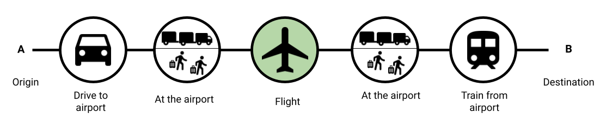
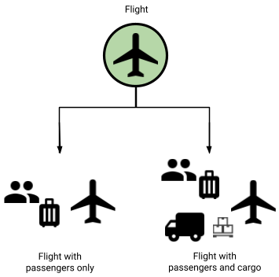

## Travel Impact Model 2.0.0

http://www.travelimpactmodel.org

## Background

In this document we describe the modeling assumptions and input specifications
behind the Travel Impact Model (TIM), a state of the art emission estimation
model that Google's Travel Sustainability team has compiled from several
external data sources. The TIM predicts greenhouse gas (GHG) emissions for
future flights to help travelers plan their travel.

ISO 14083 defines a user's travel journey from when they leave their origin
(point A) to when they arrive at their destination (point B). Figure 1[^1] below
illustrates an example of a user's travel journey. To calculate the total
emissions of this user's journey, ISO 14083 recommends summing up the emissions
produced by each individual piece of the journey. In this example, it includes
the emissions created driving to the airport, the emissions to run the origin
airport, the flight's emissions, the emissions to run the destination airport,
and the train's emissions to the user's destination. The Travel Impact Model
only estimates the flight's emissions, highlighted in green.



(Figure 1[^2])

As shown in Figure 2[^3], the TIM supports two types of flights:

* multi-class flights with passengers
* multi-class flights with passengers and cargo



(Figure 2[^4])

## Model overview

For each flight, the TIM considers several factors, such as an estimate of the
distance flown between the origin and destination airports, and the aircraft
type being used for the route. Actual GHG emissions at flight time may vary
depending on factors not known at modeling time, such as speed and altitude of
the aircraft, the actual flight route, and weather conditions at the time of
flight.

### Flight level emission estimates

#### Flight level CO<sub>2</sub>e estimates

The Travel Impact Model estimates fuel burn based on the Tier 3 methodology for
emission estimates from the
[Annex 1.A.3.a Aviation 2023](https://www.eea.europa.eu/publications/emep-eea-guidebook-2023/part-b-sectoral-guidance-chapters/1-energy/1-a-combustion/1-a-3-a-aviation.3/view)
published by the European Environment Agency (EEA).

There are several resources about the EEA model available:

*   the main
    [documentation](https://www.eea.europa.eu/publications/emep-eea-guidebook-2023/part-b-sectoral-guidance-chapters/1-energy/1-a-combustion/1-a-3-a-aviation-2023/view)
*   the
    [data set](https://www.eea.europa.eu/publications/emep-eea-guidebook-2023/part-b-sectoral-guidance-chapters/1-energy/1-a-combustion/1-a-3-a-aviation.3/view)
*   further
    [documentation](https://www.eurocontrol.int/sites/default/files/content/documents/201807-european-aviation-fuel-burn-emissions-system-eea-v2.pdf)
    on pre-work for the EEA model

Additionally, the Travel Impact Model updates the fuel burn to emissions
conversion factor to align with the
[ISO 14083](https://www.iso.org/standard/78864.html) Fuel Heat Combustion factor
and
[CORSIA Life Cycle Assessment](https://www.icao.int/environmental-protection/CORSIA/Documents/CORSIA_Eligible_Fuels/CORSIA_Supporting_Document_CORSIA%20Eligible%20Fuels_LCA_Methodology_V5.pdf),
and breaks down emissions estimates into Well-to-Tank (WTT) and Tank-to-Wake
(TTW) emissions.

Tank-to-Wake emissions account for emissions produced by burning jet fuel during
flying, take-off and landing. Well-to-Tank emissions account for emissions
generated during the production, processing, handling and delivery of jet fuel.
Well-to-Wake (WTW) emissions is the sum of Well-to-Tank (WTT) and Tank-to-Wake
(TTW) emissions.

The EEA model takes the efficiency of the aircraft into account. As shown in
Figure 3, a typical flight is modeled in two stages: *take off and landing*
(LTO, yellow) and *cruise, climb, and descend* (CCD, blue).


(Figure 3)

For each stage, there are aircraft-specific and distance-specific fuel burn
estimates. Table 1 shows an example fuel burn forecast for a Boeing 787-9 (B789)
aircraft:

Aircraft | Distance (NM) | LTO fuel forecast (kg) | CCD fuel forecast (kg)
-------- | ------------: | ---------------------: | ---------------------:
B789     | 500           | 1638                   | 5852
B789     | 1000          | 1638                   | 10874
B789     | ...           | ...                    | ...
B789     | 5000          | 1638                   | 52962
B789     | 5500          | 1638                   | 58072

(Table 1)

By using these numbers together with linear interpolation or extrapolation, it
is possible to deduce the emission estimate for flights of any length on
supported aircraft:

*   Interpolation is used for flights that are in between two distance data
    points. As a theoretical example, a 5250 nautical miles (NM) flight on a
    Boeing 787-9 will burn approximately 55517 kg of fuel during the CCD phase
    (where 55517 equals 52962 + (58072 - 52962)/2, with figures for 5000 NM
    and 5500 NM taken from Table 1).
*   Extrapolation is used for flights that are either shorter than the smallest
    supported distance, or longer than the longest supported distance for that
    aircraft type.
*   The Lower Heating Value from ISO 14083 (43.1 MJ/kg averaged over US and EU
    numbers from [source](https://www.iso.org/standard/78864.html) Table K1 and
    Table K3) and CORSIA Carbon Intensity value (74 gCO<sub>2</sub>e/MJ from
    [source](https://www.icao.int/environmental-protection/CORSIA/Documents/CORSIA_Eligible_Fuels/CORSIA_Supporting_Document_CORSIA%20Eligible%20Fuels_LCA_Methodology_V5.pdf)
    Table 5) are used to calculate the jet fuel combustion to CO<sub>2</sub>e
    conversion factor of 3.1894. The CORSIA Life Cycle Assessment methodology is
    used to calculate a WTT CO<sub>2</sub>e emissions factor of 0.6465 (WTT 15g
    CO<sub>2</sub>e/MJ added to the TTW 74 gCO<sub>2</sub>e/MJ Carbon Intensity
    to total up to the WTW lifecycle Carbon Intensity of 89 gCO<sub>2</sub>e/MJ
    from
    [source](https://www.icao.int/environmental-protection/CORSIA/Documents/CORSIA_Eligible_Fuels/CORSIA_Supporting_Document_CORSIA%20Eligible%20Fuels_LCA_Methodology_V5.pdf)
    page 22 and Table 7). The factors used are as follows:

Life Cycle Stage | Carbon Intensity Value from CORSIA  <br> (g CO<sub>2</sub>e/MJ) | Lower Heating Value from ISO 14083 <br> (MJ/kg) | Factor <br> (kg CO<sub>2</sub>e/kg)
--------------------|-----------------|------|-------------------------------
Tank-To-Wake (TTW)  | 74              | 43.1 | 3.1894 (= 74 * 43.1 / 1000)
Well-To-Tank (WTT)  | 15 (= 89 - 74)  | 43.1 | 0.6465 (= 15 * 43.1 / 1000)
Well-To-Wake (WTW)  | 89              | 43.1 | 3.8359 (= 7894 * 43.1 / 1000)

CO<sub>2</sub>e is short for CO<sub>2</sub> equivalent and includes Kyoto Gases
(GHG) as described
[here](https://ec.europa.eu/eurostat/statistics-explained/index.php?title=Glossary:Kyoto_basket#:~:text=The%20Kyoto%20basket%20encompasses%20the,sulphur%20hexafluoride%20\(SF6\)).
Warming effects produced by short-lived climate pollutants and
contrail-induced cirrus clouds are not yet included in CO<sub>2</sub>e as
calculated by the Travel Impact Model. We are working with our stakeholders in
the [governance body](https://travelimpactmodel.org/governance) to add non-CO2
effects to the model.

There is information for most commonly-used aircraft types in the EEA data, but
some are missing. For missing aircraft types, one of the following alternatives
is applied in ranked order:

*   *Supported by winglet/sharklet correction factor:* For all aircraft (with a
    corresponding IATA code) with a winglet or sharklet variant for which no native
    data exists (see [Appendix A](#appendix-a-aircraft-type-support)), a 3% discount factor will
    be applied on top of EEA estimates. The correction factor will be applied to
    the LTO and CCD numbers of the comparable type in the EEA database. We are
    basing the 3% factor on a literature review as a conservative estimate
    ([Airbus](https://aircraft.airbus.com/en/services/enhance/systems-and-airframe-upgrades/fuel-efficiency-solutions#:~:text=Sharklets%20can%20deliver%20fuel%20savings,as%20range%20and%2For%20payload.),
    [AviationBenefits](https://aviationbenefits.org/case-studies/wingtip-devices/),
    [Boeing](http://www.boeing.ch/commercial/aeromagazine/articles/qtr_03_09/pdfs/AERO_Q309_article03.pdf),
    [Cirium](https://www.cirium.com/thoughtcloud/impact-winglets-on-fuel-consumption-and-aircraft-emissions/),
    [NASA](https://spinoff.nasa.gov/Spinoff2010/t_5.html),
    [SimpleFlying](https://simpleflying.com/wing-tip-fuel-efficiency/)).
*   *Supported by fallback to previous generation aircraft type:* If there are
    estimates in the EEA data set for a previous generation aircraft type in the
    same family, from the same manufacturer, the previous generation aircraft is
    used for the estimate.
*   *Supported by fallback to least efficient aircraft in the family:* For
    umbrella codes that refer to a group of aircraft, the least efficient
    aircraft in the family will be assumed.
*   *Supported by fallback to similar aircraft type:* If there are estimates in
    the EEA data set for a similar aircraft, it is used for the estimate.
*   *Not supported:* For aircraft types for which none of the cases above apply,
    there are no emissions estimates available.

See [Appendix A](#appendix-a-aircraft-type-support) for a table with detailed
information about aircraft type support status.

#### Distance adjustment

Actual flight paths are usually longer than the great-circle distance (GCD)
between origin and destination airport due to several factors, like the flown
route, airport congestion, airspace restrictions, and bad weather avoidance.

The TIM includes distance adjustment factors based on historical flight tracking
data from ADS-B. These adjustment factors were developed at Imperial College London by
[Teoh et al.](https://egusphere.copernicus.org/preprints/2023/egusphere-2023-724/egusphere-2023-724.pdf)
who found that on average, the actual distance flown is roughly 5% higher
than the great-circle distance, and that this percentage varies across regions
and routes. The data cleaning approach is described
[here](https://zenodo.org/records/8369564/files/README.txt).

The distance adjustment is performed as follows:

1.  If available, apply the
    [route-based adjustment factor data](https://zenodo.org/records/8369564/files/origin_destination_airport_gaia_vs_eea.csv)
    for the given origin airport and destination airport. This factor represents
    the ratio between the average flown distance on the route and its
    great-circle distance.
2.  Otherwise, if available, apply the
    [country-based adjustment factor data](https://zenodo.org/records/8369564/files/origin_destination_country_gaia_vs_eea.csv)
    for the given origin airport country and destination airport country. This
    factor represents the ratio between the average flown distance for all
    flights between the origin airport country and destination airport country
    and their corresponding great-circle distances.
3.  Otherwise, in the rare case where no adjustment factor is available, apply a factor of
    1.052 which represents the mean lateral inefficiency increase (+5.2%) for
    2019 data from [Teoh et al.](https://egusphere.copernicus.org/preprints/2023/egusphere-2023-724/egusphere-2023-724.pdf)
    (see page 18), which is used for the distance adjustment factor.

#### Data sources

Used for flight level emissions:

*   EMEP/EEA air pollutant emission inventory guidebook 2023 Annex 1 version
    v1.5_18_09_2024
    ([link](https://www.eea.europa.eu/publications/emep-eea-guidebook-2023/part-b-sectoral-guidance-chapters/1-energy/1-a-combustion/1-a-3-a-aviation.3/view))
*   Teoh et al., The high-resolution Global Aviation emissions Inventory based on ADS-B (GAIA) for 2019 - 2021: Origin-destination statistics ([link](https://zenodo.org/records/8369564))
*   CORSIA Eligible Fuels Life Cycle Assessment Methodology
    ([link](https://www.icao.int/environmental-protection/CORSIA/Documents/CORSIA_Eligible_Fuels/CORSIA_Supporting_Document_CORSIA%20Eligible%20Fuels_LCA_Methodology_V5.pdf))
*   ISO 14083 ([link](https://www.iso.org/standard/78864.html))

### Breakdown from flight level to individual level

In addition to predicting a flight's emissions, it is possible to estimate the
emissions for an individual passenger on that flight. To perform this estimate,
it's necessary to perform an individual breakdown based on three relevant
factors:

1.  Number of total seats on the plane in each seating class (first, business,
    premium economy, economy)
2.  Number of occupied seats on the plane
3.  Amount of cargo being carried

The emission estimates are higher for premium economy, business and first
seating classes because the seats in these sections take up more space. As a
result, those seats account for a larger share of the flight's total emissions.
Different space allocations on narrow and wide-body aircraft are considered
using separate weighing factors.

#### Data sources

Used to determine which aircraft type was used for a given flight:

*   Aircraft type from published flight schedules

Used to determine seating configuration and calculate emissions per available
seat:

*   Aircraft Configuration/Version (ACV) from published flight schedules
*   Fleet-level aircraft configuration information from the "Seats (Equipment
    Configuration) File" provided by [OAG](https://oag.com)

#### Primary fallback for missing seat configuration

If there are no individual seat configuration numbers for a flight available
from the published flight schedules, we query the fleet-level seating data for a
unique match by carrier and aircraft. This is only possible in cases where a
carrier uses the same seating configuration for all their aircraft of a certain
aircraft model.

#### Outlier detection and basic correctness checking

If there are no individual seat configuration numbers for a flight available
from the published flight schedules, nor from the fleet-level data, or if they
are incorrectly formatted or implausible, the TIM uses aircraft-specific medians
derived from the overall dataset instead. Basic correctness checks based on
reference seat configurations for the aircraft are performed, specifically:

*   The *calculated total seat area* for a flight is the total available seating
    area. This is calculated based on seating data and seating class factors.
    For example, the total seat area for a wide-body aircraft would be:

    ```
    1.0 * num_economy_class_seats +
    1.5 * num_premium_economy_class_seats +
    4.0 * num_business_class_seats +
    5.0 * num_first_class_seats
    ```

*   The *reference total seat area* for an aircraft is roughly the median total
    seat area.

*   During a *comparison* step: If the *calculated total seat area* for a given
    flight is within certain boundaries of the reference for that aircraft, the
    filed seating data from published flight schedules is used. Otherwise the
    *reference total seat area* is used.

#### Factors details

**Seating class factors**

Seating parameters follow
[IATA RP 1726](https://www.iata.org/en/programs/environment/passenger-emissions-methodology/).
An analysis of seat pitch and width in each seating class in typical plane
configurations confirmed the accuracy of these factors.

Cabin Class     | Narrow-body aircraft | Wide-body aircraft
--------------- | -------------------- | ------------------
Economy         | 1                    | 1
Premium Economy | 1                    | 1.5
Business        | 1.5                  | 4
First           | 1.5                  | 5

**Cargo mass fraction**

Belly cargo carried on passenger flights is a contributor to total emissions. We
apportion emissions by mass. The cargo mass fraction (CMF) is defined as the
cargo mass divided by total payload, which is defined as the sum of cargo mass
and passenger mass. Passenger mass (including passenger's baggage) is approximated
by multiplying the number of passengers by 100kg, as defined in ISO 14083, Section A.4.2.

As the cargo mass fraction determines the amount of emissions apportioned to
belly cargo, the remainder is apportioned to passengers. The TIM uses a tiered
approach to determine cargo mass fraction. High resolution, specific data (i.e.
by carrier, route, and aircraft class) is preferred where available, and in the
absence of more granular data the model falls back to coarser aggregations when
no suitable high resolution options are available.

For consistency with passenger load factors, we also exclude March 2020 to
February 2022, due to the effects of the COVID-19 pandemic.

Tier 1: Highly specific cargo mass fraction

*  Where data is available for a given carrier, route, and aircraft class
    (distinguishing narrowbody and widebody aircraft), use the average cargo
    mass fraction over the last 6 years.
*  Where data is available for the given route and aircraft class, but not the
    specific carrier, use the average cargo mass fraction across all carriers
    over the last 6 years.
*  If fewer than 2000 flights are available for averaging, we do not calculate
    an average and instead fallback to the "Coarse cargo mass fraction tier"
    described below.

Tier 2: Coarse cargo mass fraction

*  Where specific data is not available, use average cargo mass fraction data,
    matching distance band and aircraft class over the last 6 years.

*  Distance bands are defined in 1000 km intervals, i.e. distances 1 km to 1000 km,
    1001 km to 2000km, etc., are grouped together. The distance is determined between
    origin and destination using the great-circle distance.

The TIM uses historical data provided by the U.S. Department of Transportation
Bureau of Transportation Statistics to determine cargo mass fraction values. The
coarse aggregations by distance band and aircraft class are also used to forecast
cargo carried for flights outside the United States.

**Load factors**

Passenger load factors are predicted based on historical passenger statistics.
The TIM uses a tiered approach to determine passenger load factors. High
resolution, specific data (i.e. by route) is preferred where available, and in
the absence of more granular data, the model falls back to a generic value (i.e.
global default).

Tier 1: Highly specific passenger load factors

1.  For flights within, to, and from the United States and its territories, we
    consider the T-100 historical dataset from the
    [US Department of Transportation Bureau of Transportation Statistics](https://www.bts.gov/airline-data-downloads)
    (see below for more details).

    *   When the data is available for a given carrier, route, and month of
        travel, we calculate the aggregate passenger load factors, looking back
        up to six years.
    *   When the data is available for a given carrier and month of travel, but
        not the specific route, we use the average passenger load factor across
        all the routes, up to six years back.
    *   If fewer than three years of data are available, we consider ch-aviation
        load factors described below.

2.  For all other flights, we consider the historical load factor data provided
    by [ch-aviation](https://www.ch-aviation.com/):

    *   When the data is available for a given carrier and month of travel, we
        calculate the aggregate passenger load factors, looking back up to six
        years.
    *   If fewer than three years of data are available, we use the global
        average fallback value instead as described below (\"*Global default
        passenger load factor*\").

Tier 2: Global default passenger load factor

*   For all other flights for which an equivalent public-domain dataset with
    similar granularity is not currently available, the TIM falls back to use a
    load factor value of **84.5%**. This value is derived from
    [historical data for the U.S.](https://fred.stlouisfed.org/series/LOADFACTOR)
    from 2019.
*   An analysis of load factors sourced from publicly available airline investor
    reports indicates that this value is a good approximation for the passenger
    load factor globally.

**Load factor data source specifics**

T-100 from
[U.S. Department of Transportation Bureau of Transportation Statistics](https://www.bts.gov/airline-data-downloads)
and [ch-aviation](https://www.ch-aviation.com/)

*   Only data from the last six years is used.
*   Data is updated on a monthly basis (TIM version number will not increase).
*   Any month of data for which the overall load factor (aggregated over all
    airlines and routes) differs more than 10% from the average load factor
    since 2017 is removed as an outlier month. March 2020–February 2022
    (inclusive) are removed from the data as a result.
*   To account for patterns of seasonality that do not correspond with the exact
    month of travel (e.g. public holidays), the previous and next month are
    taken into account for the average load factor of any given month of travel.
    E.g. For future flights in March, we aggregate over all flights in February,
    March, and April.

## Example emission estimation

For this example, we'll use a flight from Zurich (`ZRH`) to San Francisco
(`SFO`) on a `Boeing 787-9` aircraft with the following seating configuration.

Cabin Class     | Seats
--------------- | ----
Economy         | 188
Premium Economy | 21
Business        | 48
First           | 0

To get the total emissions for the flight, let's follow the process below:

1.  Calculate great-circle distance between ZRH and SFO: `9369 km` (= `5058.9
    nautical miles (NM)`)
2.  Look up the static LTO numbers and the distance-based CCD number from
    aircraft performance data (see Table 1), and interpolate fuel burn for a
    9369 km long flight:
    *   LTO `1638 kg` of fuel burn
    *   CCD `54802 kg` of fuel burn calculated like this and rounded:
        *   Apply distance adjustment factor as described
            [here](#distance-adjustment) to determine adjusted distance:
            `5058.9 * 1.0273 = 5197.00797 NM`
        *   The EEA model assumes that the aircraft travels 17 NM of the
            complete distance of the flight during the LTO cycle. Subtract 17 NM
            from the adjusted distance to account for the distance travelled in
            the LTO phase: `5197.00797 - 17 = 5180.00797 NM = 5180 NM (rounded)`
        *   Calculate the fuel burn for 5180 NM by interpolating between the
            known fuel burn values at 5000 NM (52962 kg) and 5500 NM (58072 kg):
        `52962 kg + (5180 NM - 5000 NM) * (58072 kg - 52962 kg) / (5500 NM - 5000 NM) = 54801.6 kg`
3.  Sum LTO and CCD number for total flight-level result (rounded):
    `1638 kg + 54802 kg = 56440 kg of fuel burn`

4.  Convert from fuel burn to CO<sub>2</sub>e emissions for total flight-level
    result:

    *   Well-to-Tank (WTT) emissions in kg of CO<sub>2</sub>e (rounded): `56440 * 0.6465 = 36488`
    *   Tank-to-Wake (TTW) emissions in kg of CO<sub>2</sub>e (rounded): `56440 * 3.1894 = 180010`
    *   Well-to-Wake (WTW) emissions in kg of CO<sub>2</sub>e (rounded): `(56440 *
        0.6465) + (56440 * 3.1894) = 216498`

Once the total flight emissions are computed, we apportion emissions between
belly cargo and passengers:

1.  Use the cargo mass fraction of 8% to apportion 8% of the emissions to belly
    cargo, and correspondingly 92% of emissions to passengers. All values rounded to kg.
    * Well-to-Tank (WTT) cargo emissions in kg of CO<sub>2</sub>e: `36488 * 0.08 = 2919`
    * Tank-to-Wake (TTW) cargo emissions in kg of CO<sub>2</sub>e: `180010 * 0.08 = 14401`
    * Well-to-Wake (WTW) cargo emissions in kg of CO<sub>2</sub>e: `216498 * 0.08 = 17320`
    * Well-to-Tank (WTT) passenger emissions in kg of CO<sub>2</sub>e: `36488 * 0.92 = 33569`
    * Tank-to-Wake (TTW) passenger emissions in kg of CO<sub>2</sub>e: `180010 * 0.92 = 165609`
    * Well-to-Wake (WTW) passenger emissions in kg of CO<sub>2</sub>e: `216498 * 0.92 = 199178`

Once the total flight emissions are computed, let's compute the per passenger
break down:

1.  Determine which seating class factors to use for the given flight. In the
    `ZRH-SFO` example, we will use the wide-body factors (`Boeing 787-9`).
2.  Calculate the equivalent capacity of the aircraft according to the following

        C = first_class_seats * first_class_multiplier +
            business_class_seats * business_class_multiplier + …

    In this specific example, the estimated area is:
    ```
    0 * 5 + 48 * 4 + 1.5 * 21 + 188 * 1 = 411.5
    ```

3.  Divide the total CO<sub>2</sub>e emissions by the equivalent capacity
    calculated above to get the CO<sub>2</sub>e emissions per economy seat.

    *   Well-to-Tank (WTT) emissions in kg of CO<sub>2</sub>e:
        `33569 / 411.5 = 81.577`
    *   Tank-to-Wake (TTW) emissions in kg of CO<sub>2</sub>e:
        `165609 / 411.5 = 402.452`
    *   Well-to-Wake (WTW) emissions in kg of CO<sub>2</sub>e:
        `81.577 + 402.452 = 484.029`

4.  Emissions per seat for other cabins can be derived by multiplying by
    the corresponding cabin factor.

    *   First:
        *   Well-to-Tank (WTT) emissions in kg of CO<sub>2</sub>e:
            `81.577 * 5 = 407.885`
        *   Tank-to-Wake (TTW) emissions in kg of CO<sub>2</sub>e:
            `402.452 * 5 = 2012.26`
        *   Well-to-Wake (WTW) emissions in kg of CO<sub>2</sub>e:
            `484.029 * 5 = 2420.145`
    *   Business:
        *   Well-to-Tank (WTT) emissions in kg of CO<sub>2</sub>e:
            `81.577 * 4 = 326.308`
        *   Tank-to-Wake (TTW) emissions in kg of CO<sub>2</sub>e:
            `402.452 * 4 = 1609.808`
        *   Well-to-Wake (WTW) emissions in kg of CO<sub>2</sub>e:
            `484.029 * 4 = 1936.116`
    *   Premium Economy:
        *   Well-to-Tank (WTT) emissions in kg of CO<sub>2</sub>e:
            `81.577 * 1.5 = 122.366`
        *   Tank-to-Wake (TTW) emissions in kg of CO<sub>2</sub>e:
            `402.452 * 1.5 = 603.678`
        *   Well-to-Wake (WTW) emissions in kg of CO<sub>2</sub>e:
            `484.029 * 1.5 = 726.044`
    *   Economy:
        *   Well-to-Tank (WTT) emissions in kg of CO<sub>2</sub>e: `81.577`
        *   Tank-to-Wake (TTW) emissions in kg of CO<sub>2</sub>e: `402.452`
        *   Well-to-Wake (WTW) emissions in kg of CO<sub>2</sub>e: `484.029`

5.  Scale to estimated load factor 0.845 by apportioning emissions to occupied
    seats. This results in per-passenger emissions:

    *   First:
        *   Well-to-Tank (WTT) emissions in kg of CO<sub>2</sub>e:
            `407.885 kg / 0.845 = 482.704 kg`
        *   Tank-to-Wake (TTW) emissions in kg of CO<sub>2</sub>e:
            `2012.26 kg / 0.845 = 2381.373 kg`
        *   Well-to-Wake (WTW) emissions in kg of CO<sub>2</sub>e:
            `2420.145 kg / 0.845 = 2864.077 kg`
    *   Business:
        *   Well-to-Tank (WTT) emissions in kg of CO<sub>2</sub>e:
            `326.308 kg / 0.845 = 386.163 kg`
        *   Tank-to-Wake (TTW) emissions in kg of CO<sub>2</sub>e:
            `1609.808 kg / 0.845 = 1905.098 kg`
        *   Well-to-Wake (WTW) emissions in kg of CO<sub>2</sub>e:
            `1936.116 kg / 0.845 = 2291.262 kg`
    *   Premium Economy:
        *   Well-to-Tank (WTT) emissions in kg of CO<sub>2</sub>e:
            `122.366 kg / 0.845 = 144.812 kg`
        *   Tank-to-Wake (TTW) emissions in kg of CO<sub>2</sub>e:
            `603.678 kg / 0.845 = 714.412 kg`
        *   Well-to-Wake (WTW) emissions in kg of CO<sub>2</sub>e:
            `726.044 kg / 0.845 = 859.224 kg`
    *   Economy:
        *   Well-to-Tank (WTT) emissions in kg of CO<sub>2</sub>e:
            `81.577 kg / 0.845 = 96.541 kg`
        *   Tank-to-Wake (TTW) emissions in kg of CO<sub>2</sub>e:
            `402.452 kg / 0.845 = 476.275 kg`
        *   Well-to-Wake (WTW) emissions in kg of CO<sub>2</sub>e:
            `484.029 kg / 0.845 = 572.815 kg`

Note that the model generates emission estimates for all cabin classes,
including cabin classes where the seat count is zero, as cabin classifications
are not always consistent across data providers. Therefore, providing estimates
for all cabin classes simplifies integration of the TIM's data with other
datasets.

## Legal base for model data sharing

The GHG emission estimate data are available via API under the
[Creative Commons Attribution-ShareAlike CC BY-SA 4.0](https://creativecommons.org/licenses/by-sa/4.0/)
open source license
([legal code](https://creativecommons.org/licenses/by-sa/4.0/legalcode)).

## API access

Developer documentation is available on the Google Developers site for the
[Travel Impact Model API](https://developers.google.com/travel/impact-model).

For non-developers, access to the Travel Impact Model API is also available
via the [Google Sheets Add-on](https://workspace.google.com/marketplace/app/flight_emissions_for_sheets/655425728274).

## Versioning

The model will be developed further over time, e.g. with improved load factors
methodology or more fine grained seat area ratios calculation. New versions will
be published.

A full model version will have four components: **MAJOR.MINOR.PATCH.DATE**, e.g.
1.3.1.20230101. The four tiers of change tracking are handled differently:

*   **Major versions**: Changes to the model that would break existing client
    implementations if not addressed (e.g. changes in data types or schema) or
    major methodology changes (e.g. adding new data sources to the model that
    lead to major output changes). We expect these to be infrequent but they
    need to be managed with special care.
*   **Minor versions**: Changes to the model that, while being consistent across
    schema versions, change the model parameters or implementation.
*   **Patch versions**: Implementation changes meant to address bugs or
    inaccuracies in the model implementation.
*   **Dated versions**: Model datasets are recreated with refreshed input data
    but no change to the algorithms regularly.

## Changelog

### 2.0.0

Updating base model data to EEA 2023, adding support for cargo mass fraction,
and introducing distance adjustment.

### 1.10.0

Migrating data sources for aircraft performance for some aircraft models.

### 1.9.1

Expanding T-100 coverage to include US territories. See
[section on load factors](#factors-details) for information on the T-100
dataset.

### 1.9.0

Adding carrier-level passenger load factors from
[ch-aviation](https://www.ch-aviation.com/) for flights that are not already
covered by the T-100 dataset from the
[US Department of Transportation Bureau of Transportation Statistics](https://www.bts.gov/airline-data-downloads).
Also adjusting the load factors outlier exclusion criteria from 20% to 10%
deviation from average load factor since 2017, resulting in removing March
2020–February 2022 (inclusive) (previously March 2020–February 2021). See the
[section on load factors](#factors-details) for more details.

### 1.8.0

Adding Well-to-Tank (WTT) and Tank-to-Wake (TTW) emissions break-downs to all
flight emissions. Updating the jet fuel combustion to CO<sub>2</sub> conversion
factor from the minimum value of 3.1672 to the value of 3.1894 (using Lower
Heating Value from ISO 14083 and CORSIA Carbon Intensity value), and using the
CORSIA Life Cycle Assessment methodology to implement a WTT CO<sub>2</sub>e
emissions factor 0.6465. Reference:
[ISO](https://www.iso.org/standard/78864.html),
[CORSIA](https://www.icao.int/environmental-protection/CORSIA/Documents/CORSIA_Eligible_Fuels/CORSIA_Supporting_Document_CORSIA%20Eligible%20Fuels_LCA_Methodology_V5.pdf).

### 1.7.0

Updating the jet fuel combustion to CO<sub>2</sub> conversion factor from 3.15
based on the EEA methodology to 3.1672 to align with the
[CORSIA methodology's](https://www.icao.int/environmental-protection/CORSIA/Documents/CORSIA_Eligible_Fuels/CORSIA_Supporting_Document_CORSIA%20Eligible%20Fuels_LCA_Methodology_V5.pdf)
recommended factor.

### 1.6.0

Adding carrier and route specific passenger load factors for flights from, to,
and within the U.S., taking seasonality patterns into account. We are using data
from the
[U.S. Department of Transportation Bureau of Transportation Statistics](https://www.bts.gov/).
For more details, see the [section on load factors](#factors-details).

### 1.5.1

Adding a fleet-level source for seating configuration data. For airlines that
don't file seating configuration information in flight schedules but use the
same seating configuration for all their aircraft of a certain model, a fall
back to the "Seats (Equipment Configuration) File" provided by OAG is performed.

### 1.5.0

Following recent discussions with academic and industry partners, we are
adjusting the TIM to focus on CO<sub>2</sub> emissions. While we strongly
believe in including non-CO<sub>2</sub> effects in the model long-term, the
details of how and when to include these factors requires more input from our
stakeholders as part of a governance model that's in development. With this
change, we are provisionally removing contrails effects from our CO<sub>2</sub>e
estimates but will keep the labeling as “CO<sub>2</sub>e” in the model to ensure
future compatibility.

We believe CO<sub>2</sub>e factors are critical to include in the model, given
the emphasis on them in the IPCC's AR6 report. We want to make sure that when we
do incorporate them into the model, we have a strong plan to account for time of
day and regional variations in contrails' warming impact. We are committed to
providing consumers the most accurate information as they make informed choices
about their travel options.

We continue to invest into research and collaborate with leading scientists,
NGOs, and partners to better incorporate contrails and other non-GHG impact into
our model, and we look forward to sharing updates at a later date.

### 1.4.0

Initial public version of the Travel Impact Model.

## Limitations

The model described in this document produces estimates of GHG emissions.
Emission estimates aim to be representative of what the typical emissions for a
flight matching the model inputs would be. Estimates might differ from actual
emissions based on a number of factors.

**Aircraft types:** The emissions model accounts for the equipment type as
published in the flight schedules. The majority of aircraft types in use are
covered. See [Appendix A](#appendix-a-aircraft-type-support) for a list of
supported aircraft types.

Some aircraft types are supported by falling back to a related model thought to
have comparable emissions. See
[Flight level emission estimates](#flight-level-emission-estimates) for more
details.

If no reasonable approximation is available for a given aircraft, the model will
not produce estimates for it.

**Engine information:** Beyond the aircraft type, there are other aircraft
characteristics that can have an effect on the flight emissions (e.g. engine
type, engine age, etc.) that are not currently included when computing emission
estimates.

**Fuel type:** The emissions model assumes that all flights operate on 100%
conventional fuel. Alternative fuel types (e.g. Sustainable Aviation Fuel) are
not supported.

**Seat configurations:** If there are no seat configurations individual numbers
for a flight available from published flight schedules, or if they are
incorrectly formatted or implausible, aircraft specific medians derived from the
overall dataset are employed.

**Contrail-induced cirrus clouds:** In regions of high humidity, water vapor in
the air condenses around particles of soot from an aircraft’s exhaust and
freezes. This forms cloud-like trails of condensation, or contrails for short.
Most contrails dissipate quickly, but for a small fraction of flights,
atmospheric conditions align to produce contrails that persist and spread out,
trapping heat in the atmosphere.

## Data quality

See [technical brief](https://travelimpactmodel.org/static/media/tim_model_selection.pdf) on TIM base model selection.

## How to cite TIM in publications

You are welcome to use the Travel Impact Model (TIM) in your publications. When
referencing the TIM, please cite it as in the following example:

> Google. (2022, April). *Travel Impact Model (TIM)* (Version A.B.C.YYYYMMDD)
> [Computer software]. Retrieved September 28, 2024 via API,
> https://github.com/google/travel-impact-model

The TIM is a dynamic model that is regularly updated with new data and
methodologies. To ensure that others can access the same data and calculations
you used, it is essential to include the version number and retrieval date in
your citation.

**BibTeX example:**

```bibtex
@misc{google_tim_2022,
  institution = {Google},
  title = {Travel Impact Model (TIM)},
  year = {2022},
  month = {April},
  note = {Version A.B.C.YYYYMMDD. Retrieved September 28, 2024},
  url = {https://github.com/google/travel-impact-model}
}
```

If you access the TIM programmatically through the [API](#api-access), please
mention this in your citation as well.

## Contact

We welcome feedback and enquiries. Please get in touch using this
[form](https://support.google.com/travel/contact/tim?pcff=category:travel_impact_model_\(TIM\)_specifications).

## Glossary

**CCD:** The flight phases *Climb*, *Cruise*, *and* *Descend* occur above a
flight altitude of 3,000 feet.

**CO<sub>2</sub>**: Carbon dioxide is the most significant long-lived greenhouse
gas in Earth's atmosphere. Since the Industrial Revolution anthropogenic
emissions – primarily from use of fossil fuels and deforestation – have rapidly
increased its concentration in the atmosphere, leading to global warming.

**CO<sub>2</sub>e**: CO<sub>2</sub>e is short for CO<sub>2</sub> equivalent, and
is a metric measure used to compare the emissions from various greenhouse gases
on the basis of their global-warming potential (GWP), by converting amounts of
other gases to the equivalent amount of carbon dioxide with the same global
warming potential
([source](https://ec.europa.eu/eurostat/statistics-explained/index.php?title=Glossary:Carbon_dioxide_equivalent)).

**Contrail-induced cirrus clouds**: Cirrus clouds are atmospheric clouds that
look like thin strands. There are natural cirrus clouds, and also contrail
induced cirrus clouds that under certain conditions occur as the result of a
contrail formation from aircraft engine exhaust.

**CORSIA**: Carbon Offsetting and Reduction Scheme for International Aviation, a
carbon offset and reduction scheme to curb the aviation impact on climate change
developed by the International Civil Aviation Organization.

**Effective Radiative Forcing (ERF):** Radiative forcing effects can create
rapid responses in the troposphere, which can either enhance or reduce the flux
over time, and makes RF a difficult proxy for calculating long-term climate
effects. ERF attempts to capture long-term climate forcing, and represents the
change in net radiative flux after allowing for short-term responses in
atmospheric temperatures, water vapor and clouds.

**European Environment Agency (EEA):** An agency of the European Union whose
task is to provide sound, independent information on the environment.

**Google's Travel Sustainability team**: A team at Google focusing on travel
sustainability, based in Zurich (Switzerland) and Cambridge (U.S.), with the
goal to enable users to make more sustainable travel choices.

**Great-circle Distance:** Defined as the shortest distance between two points
on the surface of a sphere when measured along the surface of the sphere.

**ICAO:** The International Civil Aviation Organization, a specialized agency of
the United Nations.

**ISO 14083**: The international standard that establishes a common methodology
for the quantification and reporting of greenhouse gas (GHG) emissions arising
from the operation of transport chains of passengers and freight
([source](https://www.iso.org/standard/78864.html)), published by the
International Organization for Standardization (ISO).

**LTO:** The flight phases *Take Off and Landing* occur below a flight altitude
of 3000 feet at the beginning and the end of a flight. They include the
following phases: taxi-out, taxi-in (idle), take-off, climb-out, approach and
landing.

**Radiative Forcing (RF):** Radiative Forcing is the instantaneous difference in
radiative energy flux stemming from a climate perturbation, measured at the top
of the atmosphere.

**Short Lived Climate Pollutants (SLCPs):** Pollutants that stay in the
atmosphere for a short time (e.g. weeks) in comparison to Long Lived Climate
Pollutants such as CO<sub>2</sub> that stay in the atmosphere for hundreds of
years.

**Tank-to-Wake
(TTW):** Emissions produced by burning jet fuel during takeoff, flight, and
landing of an aircraft.

**TIM:** The Travel Impact Model described in this document.

**Well-to-Tank
(WTT):** Emissions generated during the production, processing, handling, and
delivery of jet fuel.

**Well-to-Wake
(WTW):** The sum of Well-to-Tank (WTT) and Tank-to-Wake (TTW) emissions.

## Appendix

### Appendix A: Aircraft type support

Aircraft full name                           | IATA aircraft code | Mapping (ICAO aircraft code) | Support status
-------------------------------------------- | ------------------ | ---------------------------- | --------------
Airbus A220                                  | 220                | BCS3                         | Mapped to least efficient in family
Airbus A220-100                              | 221                | BCS1                         | Direct match in EEA
Airbus A220-300                              | 223                | BCS3                         | Direct match in EEA
Airbus A300-600                              | AB6                | A306                         | Direct match in EEA
Airbus A300B2/B4                             | AB4                | A30B                         | Direct match in EEA
Airbus A310                                  | 310                | A310                         | Direct match in EEA
Airbus A310-300                              | 313                | A310                         | Direct match in EEA
Airbus A318                                  | 318                | A318                         | Direct match in EEA
Airbus A318 (Sharklets)                      | 31A                | A318                         | Supported via winglet/sharklet correction factor
Airbus A318/319/320/321                      | 32S                | A321                         | Mapped to least efficient in family
Airbus A319                                  | 319                | A319                         | Direct match in EEA
Airbus A319neo                               | 31N                | A321                         | Mapped to least efficient in family
Airbus A319 (Sharklets)                      | 31B                | A319                         | Supported via winglet/sharklet correction factor
Airbus A320                                  | 320                | A320                         | Direct match in EEA
Airbus A320neo                               | 32N                | A20N                         | Direct match in EEA
Airbus A320 (Sharklets)                      | 32A                | A320                         | Supported via winglet/sharklet correction factor
Airbus A321                                  | 321                | A321                         | Direct match in EEA
Airbus A321neo                               | 32Q                | A21N                         | Direct match in EEA
Airbus A321 (Sharklets)                      | 32B                | A321                         | Supported via winglet/sharklet correction factor
Airbus A330                                  | 330                | A332                         | Mapped to least efficient in family
Airbus A330-200                              | 332                | A332                         | Direct match in EEA
Airbus A330-300                              | 333                | A333                         | Direct match in EEA
Airbus A330-800neo                           | 338                | A332                         | Mapped onto older model
Airbus A330-900neo                           | 339                | A339                         | Direct match in EEA
Airbus A340                                  | 340                | A345                         | Mapped to least efficient in family
Airbus A340-200                              | 342                | A345                         | Mapped to least efficient in family
Airbus A340-300                              | 343                | A343                         | Direct match in EEA
Airbus A340-500                              | 345                | A345                         | Direct match in EEA
Airbus A340-600                              | 346                | A346                         | Direct match in EEA
Airbus A350-1000                             | 351                | A35K                         | Direct match in EEA
Airbus A350                                  | 350                | A35K                         | Mapped to least efficient in family
Airbus A350-900                              | 359                | A359                         | Direct match in EEA
Airbus A380                                  | 380                | A388                         | Mapped to least efficient in family
Airbus A380-800                              | 388                | A388                         | Direct match in EEA
Antonov An-140                               | A40                | A140                         | Direct match in EEA
Antonov AN148-100                            | A81                | A148                         | Direct match in EEA
Antonov An-24                                | AN4                | AN24                         | Direct match in EEA
Antonov An-26/30/32                          | AN6                | AN26                         | Mapped to least efficient in family
Antonov An-26                                | A26                | AN26                         | Direct match in EEA
Antonov An-32                                | A32                | AN32                         | Direct match in EEA
ATR42/ATR72                                  | ATR                | AT72                         | Mapped to least efficient in family
ATR 42-300                                   | AT4                | AT43                         | Direct match in EEA
ATR 42-500                                   | AT5                | AT45                         | Direct match in EEA
ATR 72                                       | AT7                | AT72                         | Direct match in EEA
Avro RJ100                                   | AR1                | RJ1H                         | Direct match in EEA
Avro RJ85                                    | AR8                | RJ85                         | Direct match in EEA
Beechcraft 1900 Airliner                     | BE1                | B190                         | Mapped to least efficient in family
Beechcraft 1900D Airliner                    | BEH                | B190                         | Direct match in EEA
Boeing 717-200                               | 717                | B712                         | Direct match in EEA
Boeing 727-100                               | 721                | B721                         | Direct match in EEA
Boeing 737                                   | 737                | B734                         | Mapped to least efficient in family
Boeing 737                                   | 73M                | B732                         | Direct match in EEA
Boeing 737-200                               | 732                | B732                         | Direct match in EEA
Boeing 737-200                               | 73L                | B732                         | Direct match in EEA
Boeing 737-300                               | 733                | B733                         | Direct match in EEA
Boeing 737-300                               | 73N                | B733                         | Direct match in EEA
Boeing 737-300 (Winglets)                    | 73C                | B733                         | Supported via winglet/sharklet correction factor
Boeing 737-400                               | 734                | B734                         | Direct match in EEA
Boeing 737-400                               | 73Q                | B734                         | Direct match in EEA
Boeing 737-500                               | 735                | B735                         | Direct match in EEA
Boeing 737-500 (Winglets)                    | 73E                | B735                         | Supported via winglet/sharklet correction factor
Boeing 737-600                               | 736                | B736                         | Direct match in EEA
Boeing 737-700                               | 73G                | B737                         | Direct match in EEA
Boeing 737-700                               | 73R                | B732                         | Direct match in EEA
Boeing 737-700 (Scimitar Winglets)           | 7S7                | B737                         | Supported via winglet/sharklet correction factor
Boeing 737-700 (Winglets)                    | 73W                | B737                         | Supported via winglet/sharklet correction factor
Boeing 737-800                               | 738                | B738                         | Direct match in EEA
Boeing 737-800 (Scimitar Winglets)           | 7S8                | B738                         | Supported via winglet/sharklet correction factor
Boeing 737-800 (Winglets)                    | 73H                | B738                         | Supported via winglet/sharklet correction factor
Boeing 737-900                               | 739                | B739                         | Direct match in EEA
Boeing 737-900 (Winglets)                    | 73J                | B739                         | Supported via winglet/sharklet correction factor
Boeing 737MAX 7                              | 7M7                | B734                         | Mapped onto older model
Boeing 737MAX 8                              | 7M8                | B38M                         | Direct match in EEA
Boeing 737MAX 9                              | 7M9                | B39M                         | Direct match in EEA
Boeing 737MAX 10                             | 7M1                | B734                         | Mapped onto older model
Boeing 747-300/747-100/200 SUD               | 743                | B744                         | Mapped to least efficient in family
Boeing 747                                   | 747                | B744                         | Mapped to least efficient in family
Boeing 747-400                               | 744                | B744                         | Direct match in EEA
Boeing 747-400                               | 74E                | B744                         | Direct match in EEA
Boeing 747-8                                 | 74H                | B744                         | Mapped onto older model
Boeing 757                                   | 757                | B753                         | Mapped to least efficient in family
Boeing 757-200                               | 752                | B752                         | Direct match in EEA
Boeing 757-200 (Winglets)                    | 75W                | B752                         | Supported via winglet/sharklet correction factor
Boeing 757-300                               | 753                | B753                         | Direct match in EEA
Boeing 757-300 (Winglets)                    | 75T                | B753                         | Supported via winglet/sharklet correction factor
Boeing 767                                   | 767                | B764                         | Mapped to least efficient in family
Boeing 767-200                               | 762                | B762                         | Direct match in EEA
Boeing 767-300                               | 763                | B763                         | Direct match in EEA
Boeing 767-300 (Winglets)                    | 76W                | B763                         | Supported via winglet/sharklet correction factor
Boeing 767-400                               | 764                | B764                         | Direct match in EEA
Boeing 777                                   | 777                | B773                         | Mapped to least efficient in family
Boeing 777-200/200ER                         | 772                | B772                         | Direct match in EEA
Boeing 777-200LR                             | 77L                | B772                         | Mapped onto newer model
Boeing 777-300                               | 773                | B773                         | Direct match in EEA
Boeing 777-300ER                             | 77W                | B77W                         | Direct match in EEA
Boeing 787                                   | 787                | B789                         | Mapped to least efficient in family
Boeing 787-8                                 | 788                | B788                         | Direct match in EEA
Boeing 787-9                                 | 789                | B789                         | Direct match in EEA
Boeing 787-10                                | 781                | B78X                         | Direct match in EEA
Boeing (Douglas) MD-82                       | M82                | MD82                         | Direct match in EEA
Boeing (Douglas) MD-83                       | M83                | MD83                         | Direct match in EEA
Boeing (Douglas) MD-90                       | M90                | MD90                         | Direct match in EEA
Bombardier Challenger 300                    | CL3                | CL30                         | Direct match in EEA
Bombardier Regional Jet 550                  | CR5                | CRJ7                         | Mapped to least efficient in family
British Aerospace 146                        | 146                | B463                         | Mapped to least efficient in family
British Aerospace 146-100                    | 141                | B461                         | Direct match in EEA
British Aerospace 146-200                    | 142                | B462                         | Direct match in EEA
British Aerospace 146-300                    | 143                | B463                         | Direct match in EEA
British Aerospace Jetstream                  | JST                | JS41                         | Mapped to least efficient in family
British Aerospace Jetstream 31               | J31                | JS31                         | Direct match in EEA
British Aerospace Jetstream 32               | J32                | JS32                         | Direct match in EEA
British Aerospace Jetstream 41               | J41                | JS41                         | Direct match in EEA
Britten-Norman BN-2A/BN-2B Islander          | BNI                | BN2P                         | Direct match in EEA
Canadair Regional Jet                        | CRJ                | CRJ9                         | Mapped to least efficient in family
Canadair Regional Jet 100                    | CR1                | CRJ1                         | Direct match in EEA
Canadair Regional Jet 200                    | CR2                | CRJ2                         | Direct match in EEA
Canadair Regional Jet 700                    | CR7                | CRJ7                         | Direct match in EEA
Canadair Regional Jet 900                    | CR9                | CRJ9                         | Direct match in EEA
Canadair Regional Jet 1000                   | CRK                | CRJ9                         | Mapped to least efficient in family
Cessna 208B Caravan                          | CNF                | C208                         | Direct match in EEA
Cessna Citation                              | CNJ                | C500                         | Direct match in EEA
Cessna Light Aircraft.                       | CNA                | C208                         | Direct match in EEA
Cessna Light Aircraft (Single piston engine) | CN1                | C208                         | Direct match in EEA
Cessna Light Aircraft (Twin piston engines)  | CN2                | C208                         | Direct match in EEA
Cessna Light Aircraft (Single Turboprop)     | CNC                | C208                         | Direct match in EEA
Cessna Light Aircraft (Twin Turboprop)       | CNT                | C208                         | Direct match in EEA
De Havilland-Bombardier DHC2 Beaver          | DHP                | DHC2                         | Direct match in EEA
De Havilland-Bombardier DHC6 Twin Otter      | DHT                | DHC6                         | Direct match in EEA
De Havilland-Bombardier DHC7 Dash 7          | DH7                | DHC7                         | Direct match in EEA
De Havilland-Bombardier DHC8 Dash 8          | DH8                | DH8D                         | Mapped to least efficient in family
De Havilland-Bombardier DHC8-100 Dash 8/8Q   | DH1                | DH8A                         | Direct match in EEA
De Havilland-Bombardier DHC8-200 Dash 8/8Q   | DH2                | DH8B                         | Direct match in EEA
De Havilland-Bombardier DHC8-300 Dash 8/8Q   | DH3                | DH8C                         | Direct match in EEA
De Havilland-Bombardier DHC8-400 Dash 8/8Q   | DH4                | DH8D                         | Direct match in EEA
Embraer 110 Bandeirante                      | EMB                | E110                         | Direct match in EEA
Embraer 120 Brasilia                         | EM2                | E120                         | Direct match in EEA
Embraer 170                                  | E70                | E170                         | Direct match in EEA
Embraer 170/195                              | EMJ                | E190                         | Mapped to least efficient in family
Embraer 175                                  | E75                | E75S                         | Direct match in EEA
Embraer 175 (Enhanced Winglets)              | E7W                | E75L                         | Direct match in EEA
Embraer 190                                  | E90                | E190                         | Direct match in EEA
Embraer 190 E2                               | 290                | E290                         | Direct match in EEA
Embraer 195                                  | E95                | E195                         | Direct match in EEA
Embraer 195 E2                               | 295                | E295                         | Direct match in EEA
Embraer RJ 135/140/145                       | ERJ                | E145                         | Mapped to least efficient in family
Embraer RJ135                                | ER3                | E135                         | Direct match in EEA
Embraer RJ140                                | ERD                | E145                         | Direct match in EEA
Embraer RJ145                                | ER4                | E145                         | Direct match in EEA
Fairchild Dornier 228                        | D28                | D228                         | Direct match in EEA
Fairchild Dornier 328JET                     | FRJ                | J328                         | Direct match in EEA
Fairchild SA26/SA226/SA227 Merlin/Metro      | SWM                | SW4                          | Mapped to least efficient in family
Fokker 50                                    | F50                | F50                          | Direct match in EEA
Fokker 70                                    | F70                | F70                          | Direct match in EEA
Fokker 100                                   | 100                | F100                         | Direct match in EEA
Ilyushin Il-76                               | IL7                | IL76                         | Direct match in EEA
Ilyushin Il-96                               | IL9                | IL96                         | Direct match in EEA
Let 410                                      | L4T                | L410                         | Direct match in EEA
Pilatus PC-12                                | PL2                | PC12                         | Direct match in EEA
Saab 2000                                    | S20                | SB20                         | Direct match in EEA
Saab 340B                                    | SFB                | SF34                         | Direct match in EEA
Saab 340                                     | SF3                | SF34                         | Mapped to least efficient in family
Sukhoi Superjet 100-95                       | SU9                | SU95                         | Direct match in EEA
Tecnam P2012 Traveller                       | T12                | P212                         | Direct match in EEA

### Appendix B: Term Mapping Table

| TIM terminology        | ISO terminology                                                                                                               |
| ---------------------- | ----------------------------------------------------------------------------------------------------------------------------- |
| Belly cargo            | Freight transportation                                                                                                        |
| Cargo                  | Freight                                                                                                                       |
| Flight                 | Transportation chain element (TCE), specifically a single aircraft transporting a group of passengers and potentially freight |
| Flight emissions       | TCE's GHG emissions                                                                                                           |
| Tank-to-Wake (TTW)     | G<sub>vo, TCE </sub>                                                                                                          |
| Travel journey         | Transportation chain                                                                                                          |
| Type of flight         | Transport operation category (TOC)                                                                                            |
| Well-to-Tank (WTT)     | G<sub>vep,TCE</sub>                                                                                                           |
| Well-to-Wake (WTW)     | G<sub>TCE</sub>                                                                                                               |

[^1]: This figure is based on Figure 2 on page ix in ISO 14083 (2023).
[^2]: This figure uses icons from the following libraries, [Google Material Design Icons](https://github.com/google/material-design-icons) and [Material Design Icons](https://github.com/Templarian/MaterialDesign). All icons are licensed under the [Apache License 2.0](https://www.apache.org/licenses/LICENSE-2.0).
[^3]: This figure is based on Figure 6 on page 23 in ISO 14083 (2023).
[^4]: This figure uses icons from the following libraries, [Google Material Design Icons](https://github.com/google/material-design-icons) and [Vaadin Icons](https://github.com/vaadin/vaadin-icons). All icons are licensed under the [Apache License 2.0](https://www.apache.org/licenses/LICENSE-2.0).