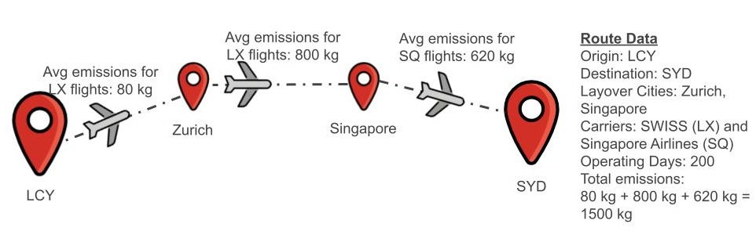
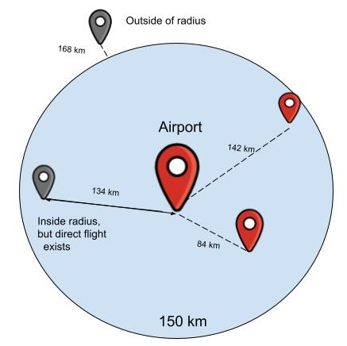

# Typical Flight Emissions

## Overview
Typical Flight Emissions are estimates of the greenhouse gas emissions produced per passenger travelling by air between two airports.

### Intended Use Cases
We have a few intended use cases for Typical Flight Emissions that are described below. The typical flight emissions values should not be used as a replacement for the [Travel Impact Model (TIM)](https://github.com/google/travel-impact-model/blob/main/README.md).

#### Badging Flights
Typical Flight Emissions can be used to badge flights as being lower, typical or higher emitting by comparing a flight's actual emissions to the typical emissions for that market[^1].

If we look at a set of flights from Zurich (ZRH) to London Heathrow (LHR), we could use the Travel Impact Model to see that emissions for a specific flight are 84 kg CO2e and let's say that the Typical Flight Emissions for ZRH to LHR was calculated to be 90 kg CO2e[^2]. In this case, we could label the flight as "lower emissions than typical".

#### Exact Itinerary is Unknown
If the exact flight details were unknown, Typical Flight Emissions can be used to get a general idea of what the emissions could have been for a flight from an origin to a destination.

#### Flight Emissions vs Other Travel Modes
Typical Flight Emissions can be used to show users how flight emissions compare to traveling the same route by train or by car to help them consider other modes of transportation.

## Methodology
To calculate Typical Flight Emissions, we start with a dataset[^3] of routes[^4] for each market. Using the Travel Impact Model, we estimate the emissions value for each route. Then, we filter the dataset to include only reasonable routes for each market. From this refined set, we calculate the weighted medians emissions, which represents the Typical Flight Emissions for that market.

Here is a step-by-step breakdown:

* [Step 1: Aggregate Routes](#step1)
* [Step 2: Assign Emissions to Route](#step2)
* [Step 3: Add Nearby Airports](#step3)
* [Step 4: Filter Unreasonably Long Routes](#step4)
* [Step 5: Get Top Routes](#step5)
* [Step 6: Calculate Weighted Median Emissions](#step6)
* [Step 7: Validate Dataset](#step7)

### Step 1: Aggregate Routes
We use aggregated route information. For example, when traveling from London to Sydney, there are several options, e.g., via Singapore on Singapore Airlines, via Dubai with Emirates, via Seoul with Asiana, and many more options.

We consider:

* the connecting cities,
* the operating carriers involved in the route,
* how often the route is operated annually (operating days per year)
* the minimum duration of the route (i.e. accounting for the whole travel time, but ignoring options with the same connecting cities and operating carriers, but longer layovers).

We exclude infrequently operated routes, which are routes with fewer than 20 operating days per year[^5].

### Step 2: Assign Emissions to Route
We assign emissions to every route. A route contains one or more legs. For each leg, we average TIM route emissions by carrier and origin and destination city[^6]. To compute the emissions of each route, we sum up the averages of each leg.

Consider a route from London to Sydney with two stops (three legs total):

For each leg, we compute the average emissions by carrier. For example, in the leg between London and Zurich, routes operated by LX emit 80 kg CO2e on average. For the leg between Zurich and Singapore, LX routes emit 800 kg CO2e on average. For the leg between Singapore and Sydney, SQ routes emit 620 kg CO2e on average. The total emissions for this route are 80 kg + 800 kg + 620 kg = 1500 kg CO2e.[^7]
If any leg of a route does not have an emissions value associated with it (e.g., because we do not know about the carrier in question operating this leg), then the route will be filtered out.

### Step 3: Add Nearby Airports
For each origin and destination airport, we consider nearby route options as well. Two airports are considered nearby if the distance between them is less than or equal to 150 kilometers[^8] and if there is no direct route between them. This distance is calculated using the longitude and latitude of each airport and the flight path is the direct path ("as the crow flies"), not driving directions.

### Step 4: Filter Unreasonably Long Routes
We exclude unreasonably long routes when shorter options are available. We apply the following filters.

#### Step 4a: Exclude Slow Routes
We exclude routes with an effective speed less than 75 km/h[^9]. The effective speed is calculated as the direct distance between origin and destination airport, divided by the total duration of the route.

#### Step 4b: Exclude Excessive Durations
We also exclude routes with excessive durations compared to the minimum duration observed for that market using the equations in the table below[^10]. The threshold is defined based on whether the route is considered short-haul, medium-haul or long-haul using [IATA's definition (pg 363)](https://guides.developer.iata.org/docs/21-1_ImplementationGuide.pdf).

| Name        | Duration    | Equation for maximum duration     |
| ----------- | ----------- | --------------------------------- |
| Short haul  | <= 3 hours  | 1.25 * minimum_duration + 1 hour  |
| Medium haul | 3-6 hours   | 1.50 * minimum_duration + 2 hours |
| Long haul   | 6+ hours    | 1.75 * minimum_duration + 2 hours |

##### Route Duration Equations

###### Short Haul
If the shortest route option is less than or equal to three hours long, we consider this short-haul and apply the upper limit of 1.25 * minimum_duration + 1h. For example, if the shortest route option is 1h long, we consider routes up to a duration of 2h15m.

###### Medium Haul
If the shortest route option is greater than three and less than or equal to six hours long, we consider this medium-haul and apply the upper limit of 1.5 * minimum_duration + 2h. For example, if the shortest route option is 5h long, we consider routes up to a duration of 9.5h.

###### Long Haul
If the shortest route option is greater than six hours long, we consider this long-haul and apply the upper limit of 1.75 * minimum_duration + 2h. For example, if the shortest route option is 10h long, we consider routes up to a duration of 19.5h.

### Step 5: Get Top Routes
After applying the above filters, we select the 20 fastest routes (if available), sorted by duration[^11], to calculate the Typical Flight Emissions. This is our "top routes" dataset.

### Step 6: Calculate Weighted Median Emissions
We select the weighted median emissions, weighing them by the number of operating days per year of each route.

In the example below, we have created a list of our "top routes" for a market. We have 4 routes with a total of 380 operating days per year and they are sorted by emissions from least to greatest.

| Emissions | Number of operating days per year |
|-----------|-----------------------------------|
| 100 kg    | 10                                |
| 120 kg    | 200                               |
| 150 kg    | 120                               |
| 200 kg    | 50                                |

To get the weighted emission for this market, we select the first route where the cumulative number of operating days is at least half of the total (weighted median). We first calculate the weighted median index. We divide the total operating days per year (380) by 2 to get 190. We then add the number of operating days row by row until we reach at least 190. This corresponding emissions value is our weighted median emissions. Since 10 + 200 = 210, which exceeds 190, the weighted median emission for this route is 120 kg CO2e.

| Emissions | Number of operating days per year | Cumulative number of operating days per year | Compare to the Weighted Median Index |
|-----------|-----------------------------------|----------------------------------------------|--------------------------------------|
| 100 kg    | 10                                | 10                                           | 10 >= 190 (no)                       |
| 120 kg    | 200                               | 210                                          | 10 + 200 >= 190 (yes)                |
| 150 kg    | 120                               | 330                                          |                                      |
| 200 kg    | 50                                | 380                                          |                                      |

### Step 7: Validate Dataset
Once we have calculated the median emissions, we validate the calculated median emissions value. We examine the "top routes" dataset to ensure it accurately represents the original routes for this market. If the "top routes" dataset only includes one route and we see that prior to [Step 4b](#step4b), we originally had more than one route, we remove this market from the dataset. This indicates that our reasonable routes filtering process may not accurately represent the available routes for this market. [^12]

## Contact Us

If you are interested in getting access to our Typical Flight Emissions dataset, please [contact us](https://support.google.com/travel/contact/tim).

 [^1]: A market refers to all of the routes between an origin and destination airport pair. It can include direct routes and indirect routes. For example, for the market Zurich (ZRH) to London Heathrow (LHR), it could include a direct route ZRH-LHR and an indirect route ZRH-AMS-LHR.

[^2]: The values in this example and all other examples on this page are for illustration only. The actual values for each flight may differ.

[^3]: Route information comes from an internal data source similar to publicly available data on websites like flightconnections.com. (We have no connection to flightconnections.com nor have we tried to use our methodology on their dataset.)

[^4]: A route is a sequence of one or more legs connecting an origin airport to a destination airport. The route can be flown multiple times per year.

[^5]: Rare routes (those with fewer than 20 operating days per year) are excluded from our dataset. These represent less than 5% of routes in our dataset.

[^6]: We calculate the average emissions by adding up all the direct flights between all airports as defined in the IATA city code. If we were calculating emissions for a direct flight on Swiss airlines from LGW to ZRH, we would consider all direct flight routes from London city to Zurich city on Swiss airlines. We would take the sum of all flights on those routes and divide it by the total number of routes. For example, if we had only 2 routes on Swiss airlines from London to Zurich, LGW-ZRH at 80 kg CO2e operating at 80 days a year and LHR-ZRH at 70 kg CO2e operating at 120 days a year, we would calculate the average as (80 * 80 kg + 120 * 70 kg)/(80 + 120) = 74 kg CO2e emissions.

[^7]: The carriers referenced in the examples in this document are just used to illustrate a potential real world scenario and have had no involvement in creating this methodology.

[^8]: The 150 km threshold for nearby airports balances the inclusion of airports serving both small towns and large cities. We wanted airports in a certain area to have the same typical value as we found that would be most intuitive for users. This means that a flight from Zurich (ZRH) to any London airport should have the same typical emissions.

[^9]: We chose this number because we found it to correlate well with the behavior of users on Google Flights. We found that > 99% of users on Google Flights selected routes with a speed of 75+ km/h.

[^10]: The multipliers (1.25, 1.5 and 1.75 for short, medium and long-haul respectively) were derived from analyzing user behavior on Google Flights.

[^11]: Two distinct routes may have the exact same duration. In this case, we enforce a stable sort order by sorting by the following criteria: if the duration differs, sort by duration ascendingly. Otherwise, if the operating days per year differs, sort by operating days descendingly. Otherwise, if the number of legs differs, sort by number of legs ascendingly. Otherwise, if the number of operating carriers involved differs, sort by number of operating carriers ascendingly. Otherwise, if there is a difference in route legs, order the routes lexicographically by the first leg that differs. Otherwise, if there is a difference in operating carriers involved lexicographically. Otherwise, consider the routes equal.

[^12]: This step removes ~60,000 out of 11 million markets from our dataset.